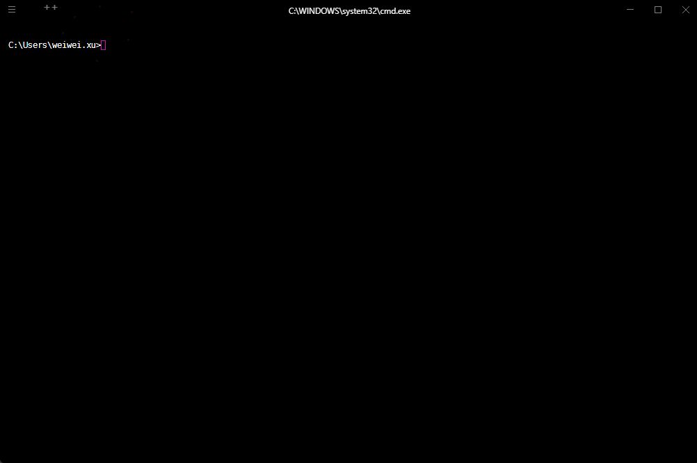
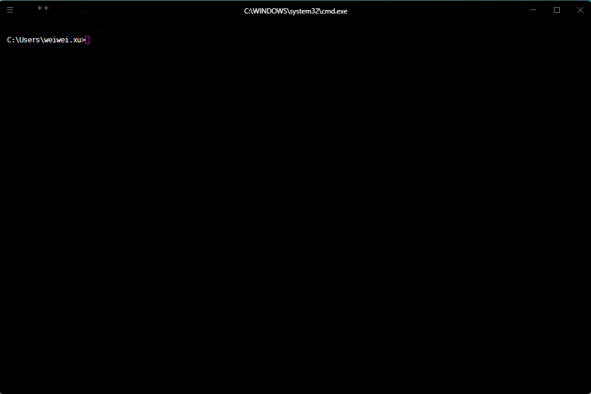
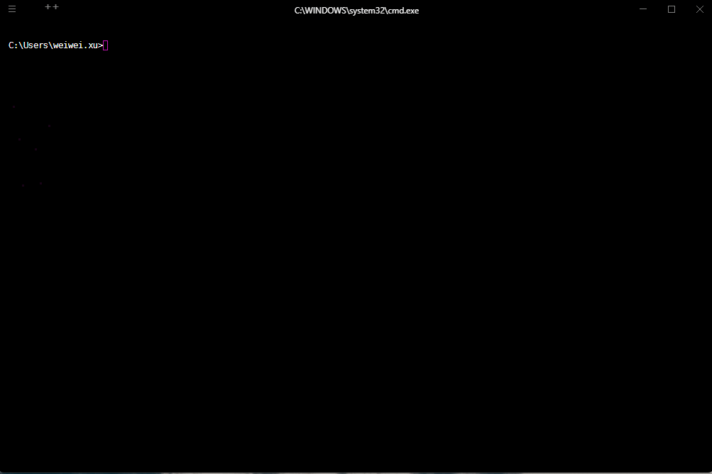

# 第一章：介绍和安装

## 1.1 介绍

### 1.1.1 概述

* [mise](https://mise.jdx.dev/) 是一个现代化的 `多语言/多工具版本管理器`，用于在单个系统上同时管理多种开发工具的不同版本，如：Node.js、Python、Java、Rust 等，并实现 `项目级环境隔离`。


* 其实，从官网的定位来说，mise 是开发环境的前端。

> [!NOTE]
>
> 问：如何理解开发环境的前端？
>
> 答：在 mise 出现之前，市面上已经有了 asdf 、nvm、pyenv、sdkman 等工具，但是它们都有缺陷，如：nvm 仅支持 Node.js、pyenv 仅支持 Python，sdkman 仅支持 JVM，虽然 asdf  支持很多工具（windows 支持有限），而 mise 是 asdf 的现代化替代品，保留生态兼容性的同时大幅提升性能和体验。

* mise 和同类工具的对比，如下所示：

| 工具     | 管理范围      | 跨语言     | 性能            | Windows 支持 |
| -------- | ------------- | ---------- | --------------- | ------------ |
| **mise** | ✅ 50+ 工具    | ✅ 统一管理 | ⚡ 极快（Rust）  | ✅ 原生支持   |
| asdf     | ✅ 100+ 工具   | ✅ 统一管理 | 🐢 较慢（Shell） | ⚠️ 有限       |
| nvm      | ❌ 仅 Node.js  | ❌          | ⚡ 快            | ✅            |
| pyenv    | ❌ 仅 Python   | ❌          | ⚡ 快            | ⚠️ 需 WSL     |
| sdkman   | ❌ 仅 JVM 工具 | ❌          | 🐢 中等          | ⚠️ 有限       |

### 1.1.2 核心特性和核心功能

* mise 的核心特性：

| 核心特性 | 说明                                                         |
| -------- | ------------------------------------------------------------ |
| 前身     | 原名 `rtx`，2023 年更名为 `mise` 。                          |
| 灵感来源 | 兼容 [asdf](https://asdf-vm.com/) 插件生态，但性能更快、功能更现代。 |
| 设计目标 | 替代 nvm + pyenv + sdkman 等多个单一工具，用一个工具统一管理所有开发环境。 |
| 跨平台   | 支持 Windows / macOS / Linux（包括 WSL）。                   |

* mise 的核心功能，如下所示：

| 核心工具              | 说明                                                         |
| --------------------- | ------------------------------------------------------------ |
| 开发工具（Dev Tools） | mise 是一个多语种工具版本管理器，其取代了 asdf 、nvm、pyenv、sdkman 等工具。 |
| 环境（Environments）  | mise 允许我们在不同项目目录中切换 ENV 变量，它可以代替 direnv 。 |
| 任务（Tasks）         | mise 是一个可以代替 Make 或 npm 脚本的任务运行工具。         |

## 1.2 安装

### 1.2.1 Windows

#### 1.2.1.1 更新 PowerShell 

* 命令：

```cmd
:: 安装/更新到最新版 PowerShell 7
winget install --id Microsoft.PowerShell --source winget

:: 启用自动更新
winget upgrade Microsoft.PowerShell --silent

:: 查看 Windows PowerShell 5.1 版本
powershell -command "$PSVersionTable.PSVersion"

:: 查看 PowerShell 7.x 版本
pwsh -command "$PSVersionTable.PSVersion"
```

> [!NOTE]
>
> PowerShell 分为 5.1 版本和 7.x 版本，如下所示：
>
> * 5.1 版本是 Windows 11 内置的版本，无法单独升级，只会随 Windows Update 自动更新安全补丁。
> * 7.x 版本是微软推出的跨平台开源版本，与 Windows PowerShell 5.1 并行运行，功能更强大、性能更好，并且 mise 的智能目录切换也需要 7.x 的支持。


* 示例：更新 PowerShell ：

::: code-group

```cmd
:: 安装/更新到最新版 PowerShell 7
winget install --id Microsoft.PowerShell --source winget

:: 启用自动更新
winget upgrade Microsoft.PowerShell --silent
```

```md:img [cmd 控制台]

```

:::


* 示例：验证是否安装成功：

::: code-group

```cmd
:: 查看 Windows PowerShell 5.1 版本
powershell -command "$PSVersionTable.PSVersion"

:: 查看 PowerShell 7.x 版本
pwsh -command "$PSVersionTable.PSVersion"
```

```md:img [cmd 控制台]

```

:::

#### 1.2.1.2 mise 卸载

* 命令：

::: code-group

```cmd [winget]
winget uninstall --id jdx.mise
```

```cmd [scoop]
scoop uninstall mise
```

:::

> [!NOTE]
>
> winget 和 scoop 是两个独立的 Windows 包管理器，它们互不依赖，所以使用什么包管理器安装 mise ，就使用对应的包管理器卸载 mise 。


* 示例：

::: code-group

```cmd
winget uninstall --id jdx.mise
```

```md:img [cmd 控制台]

```

:::


* 示例：

::: code-group

```cmd
scoop uninstall mise
```

```md:img [cmd 控制台]

```

:::

#### 1.2.1.3 mise 安装

* 命令：

::: code-group

```cmd [winget]
winget install --id jdx.mise
```

```cmd [scoop]
scoop install mise
```

:::

> [!NOTE]
>
> winget 和 scoop 是两个独立的 Windows 包管理器，它们互不依赖，只需任选其一即可。


* 示例：

::: code-group

```cmd
winget install --id jdx.mise
```

```md:img [cmd 控制台]

```

:::


* 示例：

::: code-group

```cmd
scoop install mise
```

```md:img [cmd 控制台]

```

:::

### 1.2.2 Linux


#### 1.2.2.1 mise 卸载

* 命令：

```cmd
mise implode [-y|--yes]
```

> [!CAUTION]
>
> * ① 自毁式卸载命令，执行该命令，会移除 mise 本身及其所有管理的数据（所有由 mise 安装的工具版本、配置、缓存、状态数据）。
> * ② 也可以手动移除以下目录以彻底清理，如下所示：
>
> | 目录                            | 说明                     | 环境变量覆盖                               |
> | ------------------------------- | ------------------------ | ------------------------------------------ |
> | `~/.local/share/mise`           | 工具安装目录（核心数据） | `MISE_DATA_DIR` / `XDG_DATA_HOME/mise`     |
> | `~/.local/state/mise`           | 运行状态（shims）        | `MISE_STATE_DIR` / `XDG_STATE_HOME/mise`   |
> | `~/.config/mise`                | 配置文件                 | `MISE_CONFIG_DIR` / `XDG_CONFIG_HOME/mise` |
> | `~/.cache/mise` (Linux)         | 缓存文件                 | `MISE_CACHE_DIR` / `XDG_CACHE_HOME/mise`   |
> | `~/Library/Caches/mise` (MacOS) | MacOS缓存                | `MISE_CACHE_DIR`                           |
>
> * ③ 不可逆操作：`implode` 会永久删除所有已安装的工具版本，请提前备份重要数据。
> * ④ `-y|--yes` ：该命令默认会询问用户是否删除，一旦加上 -y 参数，用户无需回答直接删除。

