> [!IMPORTANT]
>
> mise 确保所有工具、配置和任务都井井有条且准备就绪，无论你的项目使用哪种编程语言或框架。

# 第一章：介绍和安装

## 1.1 介绍

### 1.1.1 概述

* [mise](https://mise.jdx.dev/) 是一个现代化的 `统一开发环境管理工具`，它将三种核心功能整合到一个强大而单一的 CLI 中。mise 使用 Rust 编写，旨在提供高性能和高可靠性，作为一个“开发环境的前端”，用一个连贯的系统替代了多个专用工具。

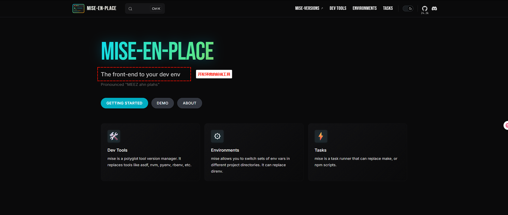

* 其实，从官网的定位来说，mise 是开发环境的前端。

> [!NOTE]
>
> 问：如何理解开发环境的前端？
>
> 答：在 mise 出现之前，市面上已经有了 asdf 、nvm、pyenv、sdkman 等工具，但是它们都有缺陷，如：nvm 仅支持 Node.js、pyenv 仅支持 Python，sdkman 仅支持 JVM，虽然 asdf 支持很多工具（windows 支持有限），而 mise 是 asdf 的现代化替代品，保留生态兼容性的同时大幅提升性能和体验。

* mise 和同类工具的对比，如下所示：

| 工具     | 管理范围      | 跨语言     | 性能            | Windows 支持 |
| -------- | ------------- | ---------- | --------------- | ------------ |
| **mise** | ✅ 50+ 工具    | ✅ 统一管理 | ⚡ 极快（Rust）  | ✅ 原生支持   |
| asdf     | ✅ 100+ 工具   | ✅ 统一管理 | 🐢 较慢（Shell） | ⚠️ 有限       |
| nvm      | ❌ 仅 Node.js  | ❌          | ⚡ 快            | ✅            |
| pyenv    | ❌ 仅 Python   | ❌          | ⚡ 快            | ⚠️ 需 WSL     |
| sdkman   | ❌ 仅 JVM 工具 | ❌          | 🐢 中等          | ⚠️ 有限       |

### 1.1.2 独特之处

* 本质上，mise 将传统上由独立工具提供的功能整合到了统一的工作流中，如下所示：

| 核心功能                      | 传统工具                                            | mise 方案                        | 优点                                                         |
| ----------------------------- | --------------------------------------------------- | -------------------------------- | ------------------------------------------------------------ |
| 开发工具版本管理（Dev Tools） | asdf，nvm，pyenv，rbenv，gvm 等（每种语言一个）     | 单一工具管理数百种开发工具       | 学习成本更低，所有语言行为一致                               |
| 环境变量（Environments）      | direnv，手动 .env 文件，shell 脚本                  | 内置环境管理，支持目录作用域配置 | 根据项目目录自动切换环境变量和配置，提供类似 direnv 的功能，但灵活性更强 |
| 任务运行（Tasks）             | make，npm scripts，package.json scripts，shell 脚本 | 统一任务系统，支持依赖管理       | 执行构建、测试和部署任务，支持依赖管理、并行执行，相比 make 或 npm scripts 提供了增强的功能 |

* 这种统一的方法消除了学习和维护多个工具的需要，降低了配置复杂性，并在整个开发工作流中提供一致的行为。

## 1.2 安装

### 1.2.1 Windows

#### 1.2.1.1 更新 PowerShell 

* 命令：

```cmd
:: 安装/更新到最新版 PowerShell 7
winget install --id Microsoft.PowerShell --source winget

:: 启用自动更新
winget upgrade Microsoft.PowerShell --silent

:: 查看 Windows PowerShell 5.1 版本
powershell -command "$PSVersionTable.PSVersion"

:: 查看 PowerShell 7.x 版本
pwsh -command "$PSVersionTable.PSVersion"
```

> [!NOTE]
>
> PowerShell 分为 5.1 版本和 7.x 版本，如下所示：
>
> * 5.1 版本是 Windows 11 内置的版本，无法单独升级，只会随 Windows Update 自动更新安全补丁。
> * 7.x 版本是微软推出的跨平台开源版本，与 Windows PowerShell 5.1 并行运行，功能更强大、性能更好，并且 mise 的智能目录切换也需要 7.x 的支持。


* 示例：更新 PowerShell ：

::: code-group

```cmd
:: 安装/更新到最新版 PowerShell 7
winget install --id Microsoft.PowerShell --source winget

:: 启用自动更新
winget upgrade Microsoft.PowerShell --silent
```

```md:img [cmd 控制台]

```

:::


* 示例：验证是否安装成功：

::: code-group

```cmd
:: 查看 Windows PowerShell 5.1 版本
powershell -command "$PSVersionTable.PSVersion"

:: 查看 PowerShell 7.x 版本
pwsh -command "$PSVersionTable.PSVersion"
```

```md:img [cmd 控制台]
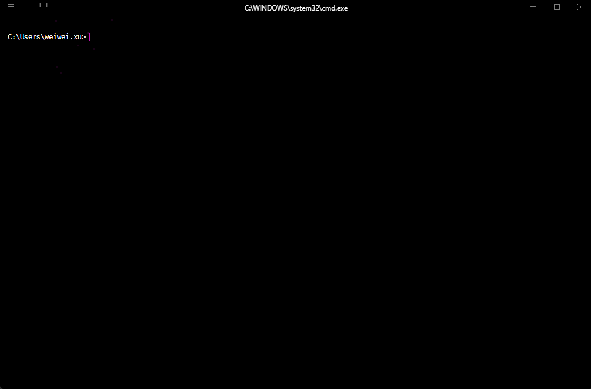
```

:::

#### 1.2.1.2 mise 卸载

* 命令：

::: code-group

```cmd [winget]
winget uninstall --id jdx.mise
```

```cmd [scoop]
scoop uninstall mise
```

:::

> [!NOTE]
>
> winget 和 scoop 是两个独立的 Windows 包管理器，它们互不依赖，所以使用什么包管理器安装 mise ，就使用对应的包管理器卸载 mise 。


* 示例：winget 卸载

::: code-group

```cmd
winget uninstall --id jdx.mise
```

```md:img [cmd 控制台]
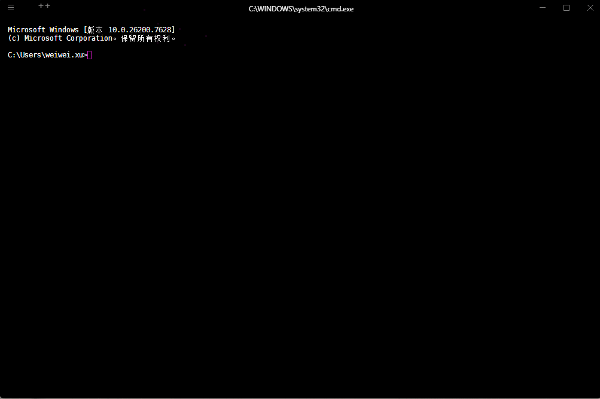
```

:::


* 示例：scoop 卸载

::: code-group

```cmd
scoop uninstall mise
```

```md:img [cmd 控制台]

```

:::

#### 1.2.1.3 mise 安装

* 命令：

::: code-group

```cmd [scoop]
scoop install mise
```

```cmd [winget]
winget install --id jdx.mise
```

:::

> [!NOTE]
>
> * ① winget 和 scoop 是两个独立的 Windows 包管理器，它们互不依赖，只需任选其一即可。
> * ② **Shims 是 mise 能“智能管理工具版本”的基石** —— 它让开发者无需关心底层实现，只需专注于项目本身。
> * ③ 推荐 Scoop 方式，因为其会自动将 Shims 添加到 PATH 中；但是，如果使用 winget 安装，需要手动在 PowerShell 中激活 Shims 。
> * ④ 如果后续需要更新 mise ，请执行如下的命令：
>
> ::: code-group
>
> ```cmd [scoop]
> scoop update mise
> ```
>
> ```cmd [winget]
> winget upgrade --id jdx.mise
> ```
>
> :::
>
> * ⑤ 如果是 winget 安装，需要手动在 PowerShell 中激活 Shims（尽量使用 7.x 版本），如下所示：
>
> ```powershell
> # ① 创建目录
> # PowerShell 5.1 用户
> New-Item -Path "$HOME\Documents\WindowsPowerShell" -ItemType Directory -Force
> # PowerShell 7+ 用户
> New-Item -Path "$HOME\Documents\PowerShell" -ItemType Directory -Force
> 
> # ② 写入 mise 初始化命令
> # PowerShell 5.1 用户
> "`$env:MISE_PWSH_CHPWD_WARNING=0" | Add-Content $PROFILE
> '(&mise activate pwsh) | Out-String | Invoke-Expression' | Add-Content -Path "$HOME\Documents\WindowsPowerShell\Microsoft.PowerShell_profile.ps1"
> # PowerShell 7+ 用户
> '(&mise activate pwsh) | Out-String | Invoke-Expression' | Add-Content -Path "$HOME\Documents\PowerShell\Microsoft.PowerShell_profile.ps1"
> 
> # ③ 验证配置文件内容
> notepad $PROFILE  # (&mise activate pwsh) | Out-String | Invoke-Expression
> 
> # 重新加载配置
> . $PROFILE
> ```


* 示例：winget 安装

::: code-group

```cmd
winget install --id jdx.mise
```

```md:img [cmd 控制台]

```

:::


* 示例：scoop 安装

::: code-group

```cmd
scoop install mise
```

```md:img [cmd 控制台]
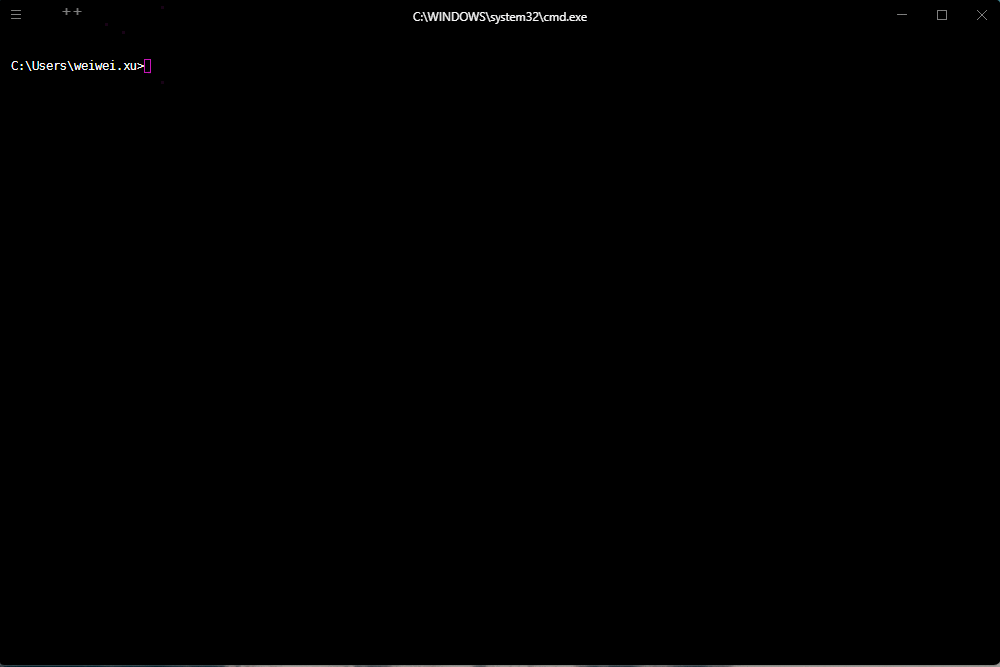
```

:::

#### 1.2.1.4 mise 激活方式

* 对于 mise 提供了两种和 Shell 激活的方式，如下所示：

| 激活方式  | 方式                                                         |
| --------- | ------------------------------------------------------------ |
| PATH 激活 | 默认方式，每次显示 shell 提示符时，mise 都会更新你的 `PATH` 和环境变量。这就是你在 shell 配置中运行 `eval "$(mise activate bash)"` 时发生的情况。mise 会动态地将工具路径添加到 `PATH` 的开头，使正确的版本可用。 |
| Shims     | 替代方式，在 `PATH` 中放置小型可执行文件。这些 shims 拦截命令并委托给 mise，由 mise 加载适当的上下文。这对于 IDE 和脚本等非交互式环境特别有用。 |

* Scoop 安装 VS Winget 安装，如下所示：

| 安装方式 | 背后的动作                                                   | 是否推荐 |
| -------- | ------------------------------------------------------------ | -------- |
| Scoop    | ① 下载并安装最新的 mise 二进制文件 <br>② 在 PATH 上配置 shims 目录 <br/>③ 为工具管理创建符号链接 | ✅        |
| Winget   | ①  与 Windows 更新生态系统的集成<br>② 系统级或用户范围内的安装选项 <br/>③ 需要手动配置 PATH 和 shell 激活 |          |

### 1.2.2 Linux

#### 1.2.2.1 mise 卸载

* 命令：

::: code-group

```shell
# 自毁式卸载命令
mise implode [-y|--yes] 
```

```cmd [AlmaLinux]
# 推荐方式，根据各自的系统版本使用对应的包管理器
dnf -y remove mise
```

```shell [Ubuntu]
# 推荐方式，根据各自的系统版本使用对应的包管理器
apt -y remove mise
```

:::

> [!CAUTION]
>
> * ① 自毁式卸载命令（前提条件是：通过脚本安装）执行该命令，会移除 mise 本身及其所有管理的数据（所有由 mise 安装的工具版本、配置、缓存、状态数据）。
> * ② 也可以手动移除以下目录以彻底清理，如下所示：
>
> | 目录                            | 说明                     | 环境变量覆盖                               |
> | ------------------------------- | ------------------------ | ------------------------------------------ |
> | `~/.local/share/mise`           | 工具安装目录（核心数据） | `MISE_DATA_DIR` / `XDG_DATA_HOME/mise`     |
> | `~/.local/state/mise`           | 运行状态（shims）        | `MISE_STATE_DIR` / `XDG_STATE_HOME/mise`   |
> | `~/.config/mise`                | 配置文件                 | `MISE_CONFIG_DIR` / `XDG_CONFIG_HOME/mise` |
> | `~/.cache/mise` (Linux)         | 缓存文件                 | `MISE_CACHE_DIR` / `XDG_CACHE_HOME/mise`   |
> | `~/Library/Caches/mise` (MacOS) | MacOS缓存                | `MISE_CACHE_DIR`                           |
>
> * ③ 不可逆操作：`implode` 会永久删除所有已安装的工具版本，请提前备份重要数据。
> * ④ `-y|--yes` ：该命令默认会询问用户是否删除，一旦加上 -y 参数，用户无需回答直接删除。
> * ⑤ 如果通过 bash、zsh 以及 fish ，还需要在卸载之后，手动将 `~/.zshrc`、`~/.bashrc`或 `~/.config/fish/config.fish` 中的激活配置删除。


* 示例：脚本方式卸载

::: code-group

```shell
# 卸载自身
mise implode -y

# 清理的配置文件列表
sed -i '/mise activate/d' ~/.bashrc && source ~/.bashrc
sed -i '/mise activate/d' ~/.zshrc && source ~/.zshrc
sed -i '/mise activate/d' ~/.config/fish/config.fish && source ~/.config/fish/config.fish
```

```md:img [cmd 控制台]
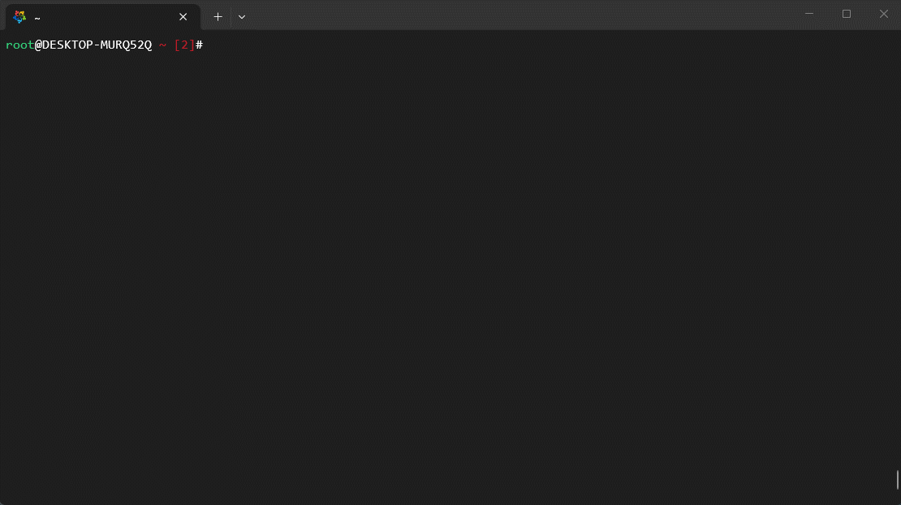
```

:::


* 示例：AlmaLinux 卸载

::: code-group

```shell
dnf -y remove mise
```

```md:img [cmd 控制台]
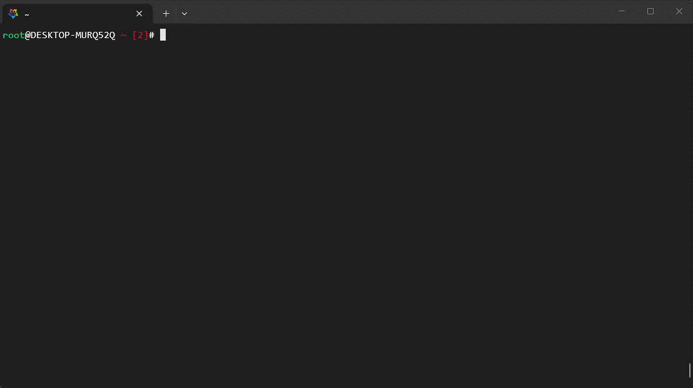
```

:::


* 示例：Ubuntu 卸载

::: code-group

```shell
apt -y remove mise
```

```md:img [cmd 控制台]
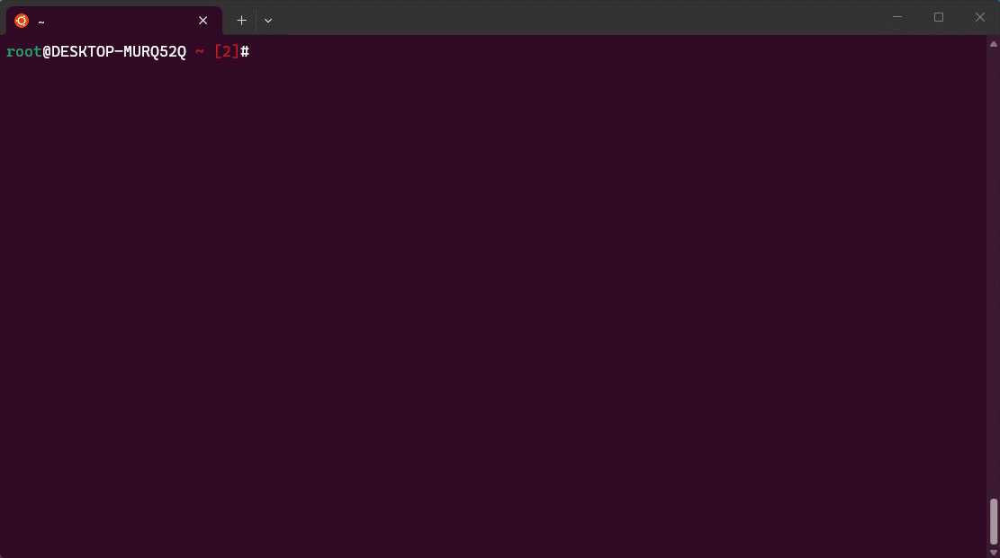
```

:::

#### 1.2.2.2 mise 安装&激活

* 命令：

::: code-group

```shell
# 通用安装方式，需要根据提示手动激活
curl https://mise.run | sh
```

```shell [AlmaLinux]
# 推荐方式，根据各自的系统版本使用对应的包管理器
# Fedora 41+，RHEL 9+，CentOS Stream 9+
# 安装
dnf copr enable jdxcode/mise -y
dnf install mise -y
# 激活
grep -q "mise activate" ~/.bashrc || echo 'mise activate bash' >> ~/.bashrc
grep -q "mise activate" ~/.zshrc || echo 'mise activate zsh' >> ~/.zshrc
grep -q "mise activate" ~/.config/fish/config.fish || echo "mise activate fish | source" >> ~/.config/fish/config.fish
```

```shell [Ubuntu]
# 推荐方式，根据各自的系统版本使用对应的包管理器
# Ubuntu 26.04 之前的版本
# 安装
sudo apt update -y && sudo apt install -y curl
sudo install -dm 755 /etc/apt/keyrings
curl -fSs https://mise.jdx.dev/gpg-key.pub | sudo tee /etc/apt/keyrings/mise-archive-keyring.asc 1> /dev/null
echo "deb [signed-by=/etc/apt/keyrings/mise-archive-keyring.asc] https://mise.jdx.dev/deb stable main" | sudo tee /etc/apt/sources.list.d/mise.list
sudo apt update -y
sudo apt install -y mise
# 激活
grep -q "mise activate" ~/.bashrc || echo 'mise activate bash' >> ~/.bashrc
grep -q "mise activate" ~/.zshrc || echo 'mise activate zsh' >> ~/.zshrc
grep -q "mise activate" ~/.config/fish/config.fish || echo "mise activate fish | source" >> ~/.config/fish/config.fish

# Ubuntu 26.04+ 之后的版本
# 安装
sudo add-apt-repository -y ppa:jdxcode/mise
sudo apt update -y
sudo apt install -y mise
# 激活
grep -q "mise activate" ~/.bashrc || echo 'mise activate bash' >> ~/.bashrc
grep -q "mise activate" ~/.zshrc || echo 'mise activate zsh' >> ~/.zshrc
grep -q "mise activate" ~/.config/fish/config.fish || echo "mise activate fish | source" >> ~/.config/fish/config.fish
```

:::


* 示例：脚本方式安装，并根据提示激活

::: code-group

```shell
curl https://mise.run | sh
```

```md:img [cmd 控制台]
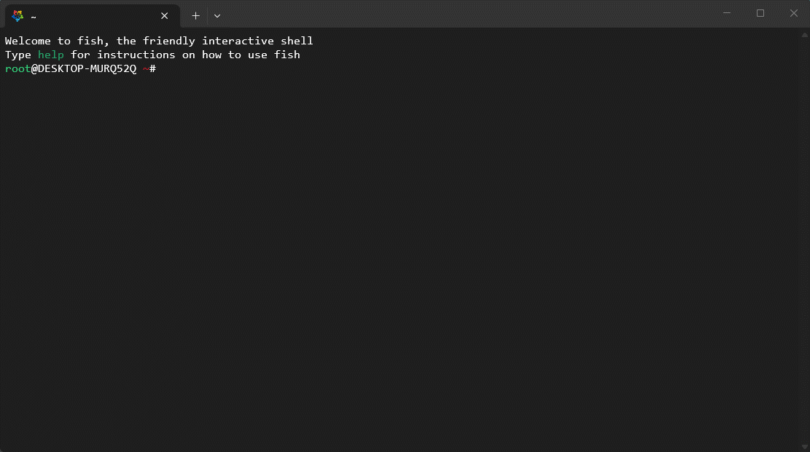
```

:::


* 示例：AlmaLinux 安装&激活

::: code-group

```shell
# 安装
dnf copr enable jdxcode/mise -y
dnf install mise -y
# 激活
grep -q "mise activate" ~/.bashrc || echo 'mise activate bash' >> ~/.bashrc
grep -q "mise activate" ~/.zshrc || echo 'mise activate zsh' >> ~/.zshrc
grep -q "mise activate" ~/.config/fish/config.fish || echo "mise activate fish | source" >> ~/.config/fish/config.fish
```

```md:img [cmd 控制台]
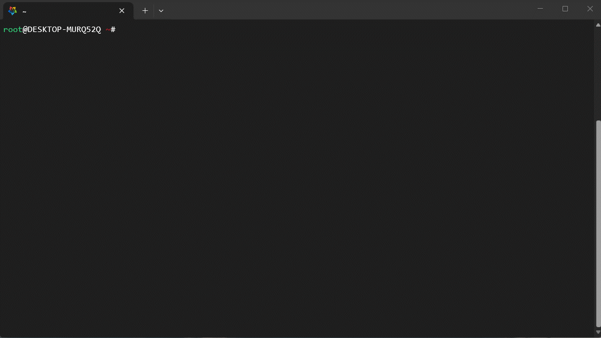
```

:::


* 示例：Ubuntu 安装&激活

::: code-group

```shell
# 安装
sudo apt update -y && sudo apt install -y curl
sudo install -dm 755 /etc/apt/keyrings
curl -fSs https://mise.jdx.dev/gpg-key.pub | sudo tee /etc/apt/keyrings/mise-archive-keyring.asc 1> /dev/null
echo "deb [signed-by=/etc/apt/keyrings/mise-archive-keyring.asc] https://mise.jdx.dev/deb stable main" | sudo tee /etc/apt/sources.list.d/mise.list
sudo apt update -y
sudo apt install -y mise
# 激活
grep -q "mise activate" ~/.bashrc || echo 'mise activate bash' >> ~/.bashrc
grep -q "mise activate" ~/.zshrc || echo 'mise activate zsh' >> ~/.zshrc
grep -q "mise activate" ~/.config/fish/config.fish || echo "mise activate fish | source" >> ~/.config/fish/config.fish
```

```md:img [cmd 控制台]
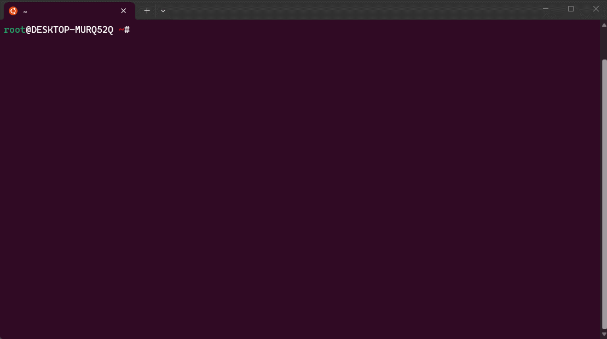
```

:::

#### 1.2.2.3 命令自动补全

* 命令：

::: code-group

```shell [bash]
# 安装 usage 包
mise use -g usage
# 安装命令自动补全脚本
mkdir -p ~/.local/share/bash-completion/completions/
echo 'mise completion bash --include-bash-completion-lib' > ~/.local/share/bash-completion/completions/mise
# 重启 shell
exec bash
```

```shell [zsh]
# 安装 usage 包
mise use -g usage
# 安装命令自动补全脚本
echo $fpath | tr ' ' '\n'
mkdir -p /usr/local/share/zsh/site-functions
mise completion zsh  > /usr/local/share/zsh/site-functions/_mise
# 重启 shell
exec zsh
```

```shell [fish]
# 安装 usage 包
mise use -g usage
# 安装命令自动补全脚本
mise completion fish > ~/.config/fish/completions/mise.fish
# 重启 shell
exec fish
```

:::

> [!NOTE]
>
> 命令自动补全：当我们输入命令的部分内容时，按特定按键（Tab），系统会自动帮助我们 `补全剩余部分` 或 `列出可能的选项`，如：`mise inst`  →  `mise install` 。


* 示例：演示 fish 命令自动补全 

::: code-group

```shell [fish]
# 安装 usage 包
mise use -g usage
# 安装命令自动补全脚本
mise completion fish > ~/.config/fish/completions/mise.fish
# 重启 shell
exec fish
```

```md:img [cmd 控制台]
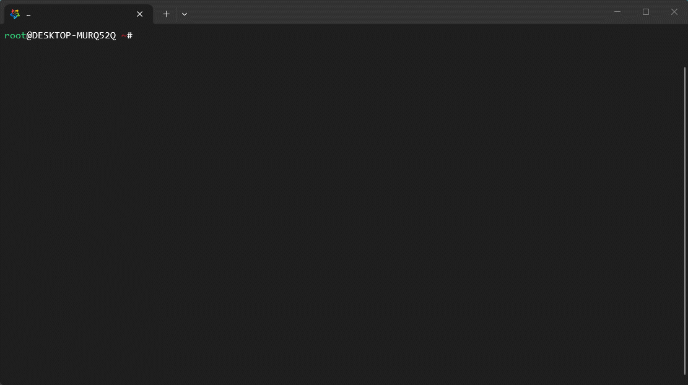
```

:::


# 第二章：TOML

## 2.1 概述

* TOML 是为人而生的配置文件格式，即：TOML 旨在成为一个语义明显且易于阅读的最小化配置文件格式，TOML 被设计成可以无歧义地映射为哈希表。TOML 应该能很容易地被解析成各种语言中的数据结构。

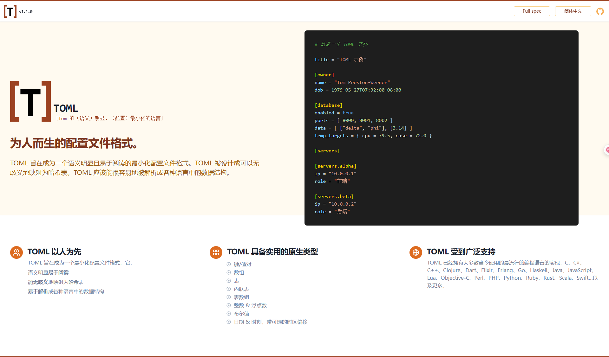


```
mise complete --shell powershell >> $PROFILE
```

