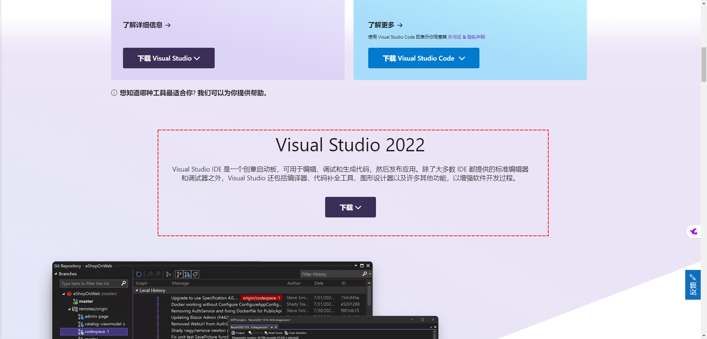
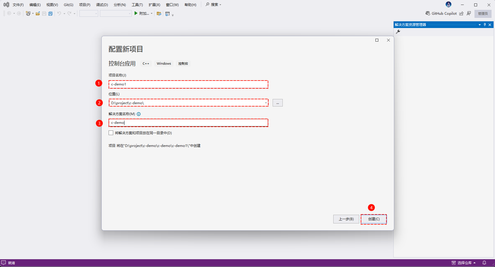
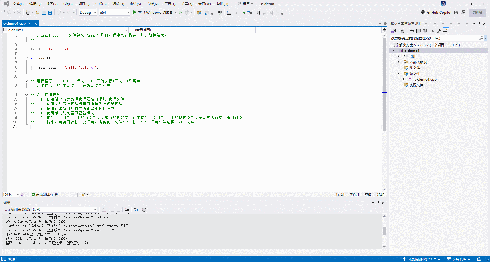
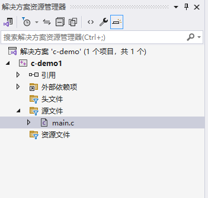
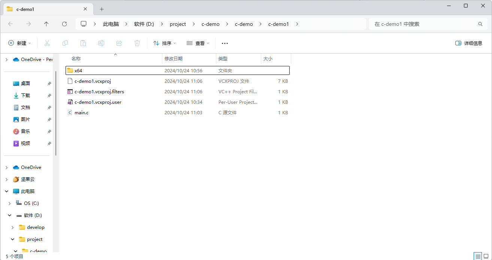
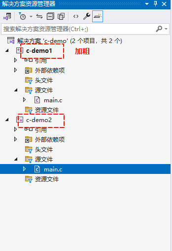

# 第一章：简介

## 1.1 概述

* 微软在官网上，是这么评价自己的 IDE 的，如下所示：



## 1.2 为什么选择 Visual Studio ？

* Visual Studio 的核心功能，如下所示：
  * 智能代码补全和错误检测。
  * 内置调试器，支持断点和逐步调试。
  * Git 版本控制集成。
  * 丰富的扩展插件市场。
  * 多种应用程序模板。
  * NuGet 包管理器。
* Visual Studio 支持的编程语言很多，如：C#、C++、F#、Python、JavaScript、TypeScript 等。
* Visual Studio 的主要应用场景，如下所示：
  - .NET 应用程序开发（网页、桌面、移动应用）。
  - ASP.NET网站开发。
  - Windows桌面应用程序（WPF、WinForms）。
  - 跨平台开发。
  - 数据库开发。


# 第二章：Visual Studio 入门

## 2.1 创建项目

* ① 打开 Visual Studio，选择`继续但无需代码`：


* ② 进入主界面：


* ③ 点击 VS 菜单栏的`文件-->新建-->项目`，进行项目创建：


* ④ 选择`项目模板`（控制台项目）：

> [!NOTE]
>
> * ① 也可以选择空项目或 CMake 项目。
> * ② 不过，本次以`控制台`项目作为演示！！！


* ⑤ 进入项目配置页面：

> [!NOTE]
>
> 需要填写项目配置相关的信息，如下所示：
>
> * ① 项目的名称。
> * ② 位置。
> * ③ 解决方案名称。



## 2.2 项目配置

### 2.2.1 概述

* 在上述的`项目配置`页面，我们不难发现需要我们填写`项目的名称`、`位置`以及`解决方案名称`；那么，解决方案是什么？和项目名称又有什么关系？

### 2.2.2 解决方案 VS 项目

* `解决方案是 VS 中进行代码开发的顶层结构，它是一个或多个项目的容器。`用于协调多个项目之间的关系和依赖性，尤其是在大型应用程序开发中。解决方案不仅仅是项目的简单列表，它还包括项目之间的依赖关系、编译顺序以及其他元数据。

> [!NOTE]
>
> 解决方案的文件夹下通常会自动生成一个扩展名为 `xxx.sln`  的文件，来保存这些项目之间关系的信息。

* `项目是一个 C 程序构建过程中的基本组织单元。`目中会包含：源代码文件、资源文件（如图片或数据文件）、配置信息文件等。

> [!NOTE]
>
> * ① VS 中的项目是一个进行开发的基本单元，一个解决方案至少有一个项目，也可以包含多个项目，这些项目之间是可以相互依赖的。
>* ② 解决方案是项目的集合。

* 那么，`解决方案`和`项目`在逻辑上，就是这样的：


> [!NOTE]
>
> 如果你使用 CLion 进行项目开发；那么，CLion 和 VS 还是有点差别的，如下所示：
>
> * CLion 中的`模块`对应 VS 中的`项目`。
> * CLion 中的`项目`对应 VS 中的`解决方案`。

* 其实，从`位置`中，我们也可以看出 VS 中的`解决方案`和`项目`的关系，如下所示：


## 2.3 创建源文件

* 当项目创建完成后，会显示如下的界面：


* 但是，项目默认创建的不是 C 源文件，而是 C++ 源文件；此时，我们需要将其删掉，再创建 C 源文件，如下所示：



## 2.4 编写 C 代码

* 创建好了 C 源文件之后，就可以编写 C 代码了，如下所示：

> [!NOTE]
>
> 演示的 C 语言代码，如下所示：
>
> ::: details 点我查看
>
> ```c
> #include <stdio.h>
> 
> int main(){
> 
>  printf("Hello World!!!");
> 
>  return 0;
> }
> ```
>
> :::
>
> 编写完毕之后，记住需要通过 Ctrl + S 快捷键来保存！！！


* 代码编写完毕之后，就可以通过 VS 菜单栏上的按钮来启动程序，如下所示：

> [!NOTE]
>
> * ① 如果点击的是`本地 Windows 调试器`按钮来启动程序，此时程序将以`Debug`的模式来启动。
> * ② 如果点击的是`开始执行（不调试）`按钮来启动程序，此时程序将以`正常`的模式来启动。


# 第三章：Visual Studio 高级配置

## 3.1 Visual Studio 项目目录说明

* 在 VS 中的解决方案管理器中，我们可以看到项目下面分为了好几个层级，如下所示：



* 我们可以在`解决方案管理`中选择一个`项目`，通过`鼠标右键`点击`在文件资源管理器中打开文件夹`来查看，解决方案在硬盘上的实际文件目录，如下所示：


* 但是，我们却发现并没有我们想要的`头文件目录夹`、`源文件目录夹`等，如下所示：



* 其实，是因为 VS 项目中的`头文件目录夹`、`源文件目录夹`等并不是物理上的目录，而是一个逻辑上的目录而言，是虚拟的，它们是存储在 `xxx.vcxproj` 文件中，该文件用来存储同一个项目中的各个文件之间的关系。那么，VS 中的解决方案、项目以及项目中的文件就是这样的，如下所示：


> [!CAUTION]
>
> * ① 对于 VS 中的项目而言，一个项目只能有一个 main 函数；如果有多个 main 函数，VS 将不清楚项目的入口到底在哪里？
> * ② 如果希望写两个以上的 main 函数，那么请创建多个项目！！！

## 3.2 多项目启动

* 在解决方案中再创建一个项目，形成多项目，如下所示：

> [!NOTE]
>
> 如果解决方案中有多个项目，VS 会为每个项目都生成可执行文件！！！


* 其实，不管我们怎么启动程序，都会发现默认启动的只是 VS 中的第一个项目，如下所示：


* 其实，当前正在启动的项目，项目名称是加粗的，如下所示：



* 对于多项目，我们可以在`解决方案资源管理器`中的`项目名`，通过`鼠标右键`设置该项目为`启动项目`，如下所示：


* 当然，VS 除了可以设置固定的启动项目外，还可以将`启动项目`设置为`当前选定的内容`，如下所示：


## 3.3 更好用的代码提示功能

* 之前，在写代码的时候，遇到代码提示，总需要先按 Tab 键再回车，实现麻烦，如下所示：


* 其实，也可以设置为直接按回车就可以选择代码，如下所示：

> [!NOTE]
>
> 步骤：
>
> * ① VS 的菜单栏中的`工具 --> 选项`。
> * ② 在左侧的导航树中，选择`文本编辑器-->C/C++-->高级`。
> * ③ 在右侧的设置列表中，将`主动提交成员列`表改为 `True` 。


## 3.4 查看或修改项目中 C 语言的版本

* 我们可以查看或修改项目中的 C 语言的版本，如下所示：

> [!NOTE]
>
> 步骤：
>
> * ① 选择`项目`，`鼠标右键`。
> * ② 找到`属性`，`鼠标左键`并`点击`。
> * ③ 在`配置属性`中的`常规`中，就可以查看或修改项目中 C 语言的版本。


## 3.5 多项目启动插件

* 在使用 VS 学习 C 语言中的过程中，不可避免要创建多个项目，如果像上面的方式进行多项目的启动，实在太麻烦了，其实我们可以安装`可视化`的`启动项目`的插件（`SwitchStartupProject`），如下所示：

> [!NOTE]
>
> 步骤：
>
> * ① VS 的菜单栏中的`扩展--> 管理扩展`中，搜索该插件。
> * ② 安装并重启 VS。


* 此时，就可以很方便的进行项目的切换了，如下所示：


## 3.6 固定当前项目为启动项目

* 安装了上述的插件，虽然切换项目很方便；但是，还需要每次都点击选择启动项，如下所示：


* 我们希望点击那个项目中的 `main.c` 文件，那个项目就是启动项目；此时，我们就可以这么设置，如下所示：

> [!NOTE]
>
> 步骤：
>
> * ① VS 的菜单栏中的`工具--> 选项`。
> * ② 在左侧的导航树中，选择`项目和生成方案`。
> * ③ 在右侧的设置列表中，选中`对于新解决方案，使用当前选定的项目作为启动项目`。


* 此时，就可以实现我们上述的目标了，如下所示：


