电流、电压、电阻、电路、直流电和交流电、弱电和强电、家庭电路、欧姆定律、功率计算、焦耳定律、串联电路和并联电路

# 第一章：前置知识

## 1.1 概述

* 主要是为了了解一些 `物质微观` 上的知识，即：`原子结构`。

> [!NOTE]
>
> 问：既不是物理课也不是化学课，了解这些，有啥用？
>
> 答：为了对电学中的很多概念和结论，有一个更好的理解，也为了方便后续的学习和进阶。

* 世界万物都是由 `原子` 构成；换言之，`原子` 是构成物质的 `最小单位`，而 `原子` 是由 `原子核（质子+中子）` 和 `电子` 组成。

* 下图是 `碳原子` 的简易模型图，如下所示：

> [!NOTE]
>
> * ① `质子` 和 `中子` 紧密结合在一起，且处于中心的位置，形成 `原子核`。
>
> * ② 此处提及的 `原⼦结构`，是为了给后续的：`电流`、`电压`、`⼆极管`、`三极管` 等知识做铺垫，但也会忽略掉⼀些与电学⽆关的知识，如：有些元素（氢的同位素氕）没有中⼦；中⼦和质⼦的⽐例关系，会对元素的放射性有⼀定影响等。

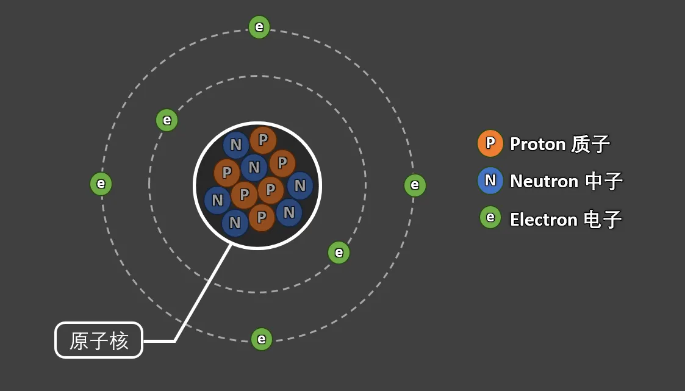

## 1.2 质子（Proton）

* `质⼦` 是带⼀个单位的 `正电荷`，且 `质⼦数量` 决定着元素 `身份`，即：在 `元素周期表` 中的顺序，如：`碳` 在 `元素周期表` 的序号是 `6` ，就是因为其有 `6` 个 `质子`。

> [!NOTE]
>
> ::: details 点我查看 元素周期表
>
> 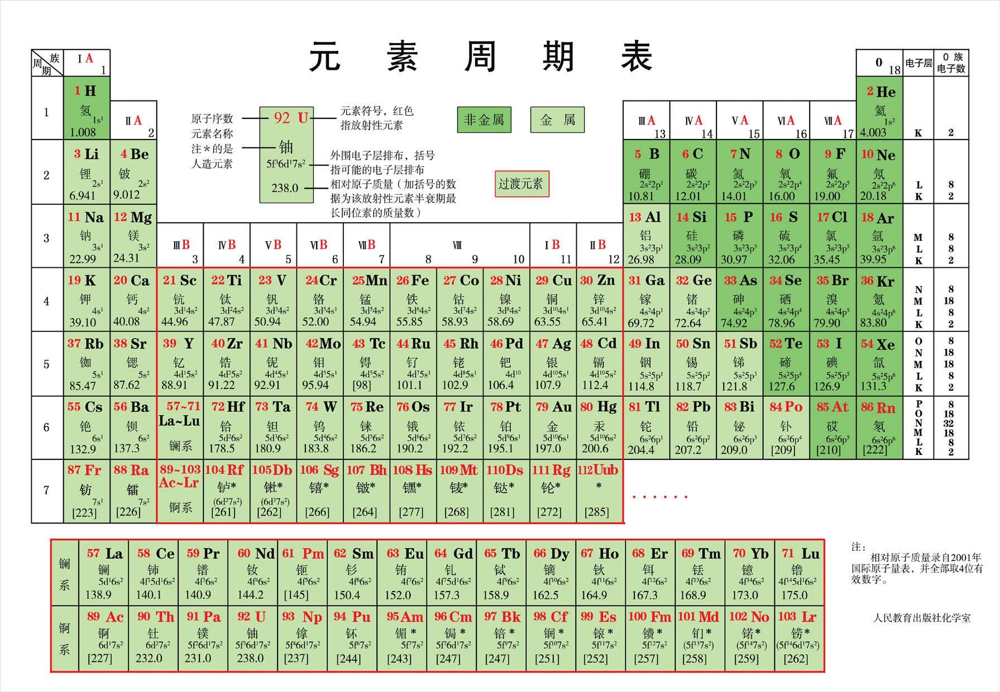
>
> :::

* 例如：如果将 `铅` 干掉 `3` 个质子就变为了 `金`，如下所示：

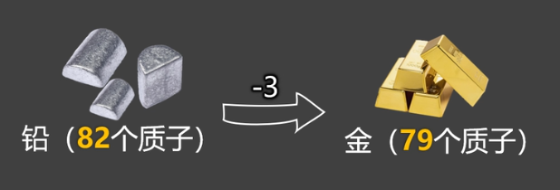

* 但是，实际上质⼦之间结合地⾮常紧密，几乎没有办法将它们分开，这也是炼金术未能实现的原因。

> [!NOTE]
>
> 拓展内容：现代物理学中的 `核反应堆`、`粒子加速器` 等可以实现上述过程，但所需能量和成本非常高，已经远超黄金的价值了，而且这种反应通常很难精确控制，产出的黄金量可能很少。

## 1.3 中子（Neutron）

* `中子`不带电，且 `中子` 对原子的影响远小于 `质子`。

> [!NOTE]
>
> `电学领域` 通常不对 `中⼦` 进⾏深⼊探讨，因为它不带电荷，不直接影响电势、电流的形成。

## 1.4 电子（Electron）

* `电子` 是带⼀个单位的 `负电荷`，其围绕 `原子核` 做 `无规则` 的运动。

> [!NOTE]
>
> ::: details 点我查看 具体细节
>
> * ① 早期的 `波尔模型`，将 `电子的运动` 比作成 `宇宙` 中 `行星` 的 `轨道运动`。
>
> 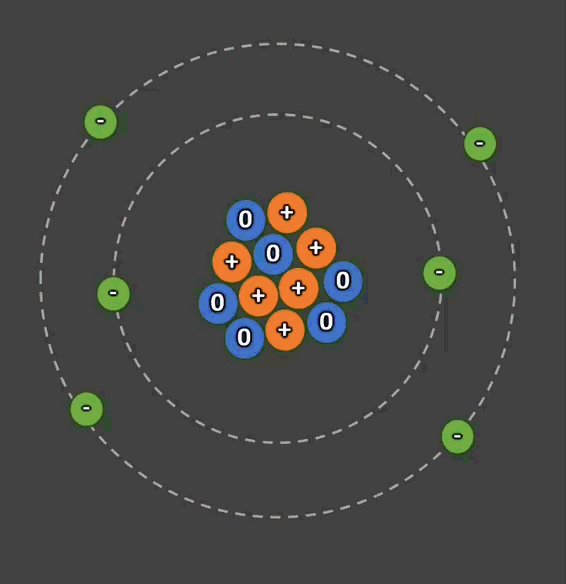
>
> * ② 但是，随着量子力学的发展，这种比喻并不完全正确，因为电子的运动其实没有一个固定的轨道，所谓的 `轨道` 其实是电子出现的概率区域，并不是一个具体的路径。
>
> 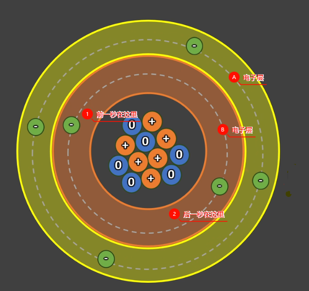
>
> :::

* `电子`围绕 `原子核` 活动的范围，就是 `电子层`。

> [!NOTE]
>
> ::: details 点我查看 具体细节
>
> * ① `电子层` 可以理解为 `电子的能量分布层`，其大致规律是 `越往外能量越高`。
>
> 
>
> * ② 每个电⼦层上最多可容纳的电⼦数为 ： `2n^2` （ `n` 是电⼦层的编号），如下所示：
>
> | 层数（n） | 最多容纳的电子数（个） |
> | --------- | ---------------------- |
> | 1         | 2 * 1^2 = 2 个电⼦     |
> | 2         | 2 * 2^2 = 8 个电⼦     |
> | 3         | 2 * 3^2 = 18 个电⼦    |
>
> 
>
> * ③ `2n^2` 计算的事每一层 `理论` 上的 `极限值`，实际上，并非所有的电子层都会完全填满，因为每一层还分为多个 `亚层`，电子会按照能量从低到高，依次填充到这些 `亚层` 。
>
> 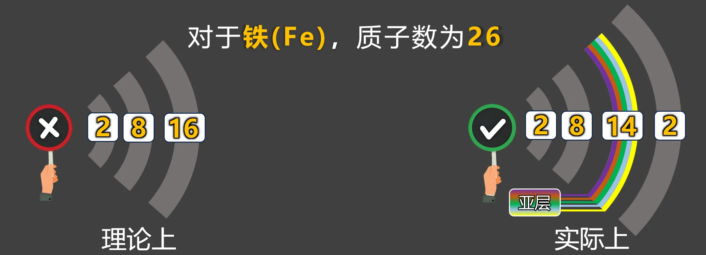
>
> :::

* `最外层`电子数为 `8` 的时候，通常是较稳定的状态。

> [!NOTE]
>
> ::: details 点我查看 具体细节
>
> * ① 可以在 `元素周期表` 中查看 `电子` 在 `每层` 的`具体个数`。
>
> 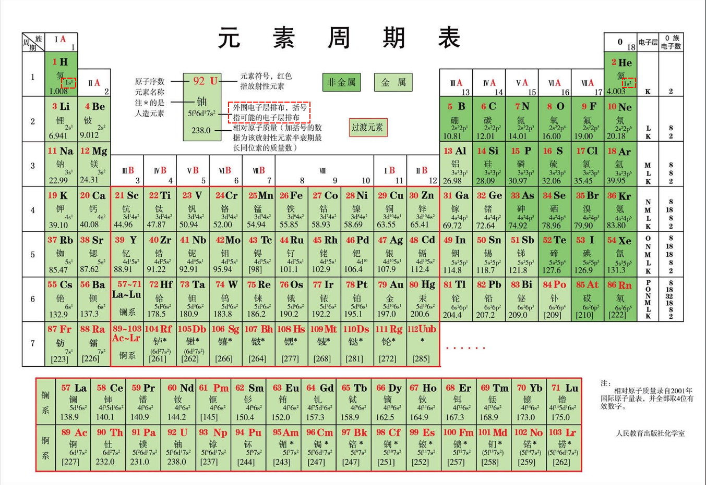
>
> * ② 许多元素在化学反应中，会倾向于通过 `获取电子`、`失去电子`、`共享电子` 等，来尽可能得到 8 电子的稳定结构，这种现象称为：`八耦规则`。但是，也有一些例外的元素，如：氢  (H) 、氦 (He) 只需要 2 个电⼦就能达到稳定状态。
>
> :::

* 通常来说，`原子` 的 `质子数` 和 `电子数` 相等，其内部的 `正电荷` 和 `负电荷` 互相 `抵消`，原子呈 `电中性`。

> [!NOTE]
>
> 问：既然同种电荷是互斥的，那为啥原子核中质子结合的如此紧密？
>
> 答：质子之间离的非常近，如果离的足够近，就会产生一种新的力，就是强相互作用力，该力是远远大于电荷之间的斥力和引力的，所以原子核才会如此稳定。

* `不同` 电荷之间互相 `吸引`，`相同` 电荷之间互相 `排斥`，具体计算参考库伦定律 $F = k \frac{|q_1 q_2|}{r^2}$。

> [!NOTE]
>
> ::: details 点我查看 具体细节
>
> * ① `q1` 和 `q2`  ：两个电荷的电荷量。
> * ② `r` ：两个电荷之间的距离。
> * ③ `k`：库仑常数，在不同的介质中，如：空⽓、⽔等，𝑘 值会有所变化。
>
> :::

* `最外层 `的电⼦更容易 `脱离原⼦`，因为它们与原⼦核的 `距离较远`，受到的 `引⼒较弱`。

## 1.5 原子之间的组合

### 1.5.1 简化碳原子的原子模型

* 将 `中间区域`（原子核【质子和中子】）使用一个 `黄色` 的圆来简化，并使用 `C` 来表示。

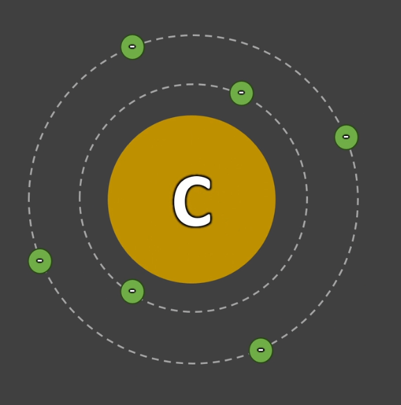

* 将周围的电子放大一下，以便观察，并去掉 `-` 符号。

 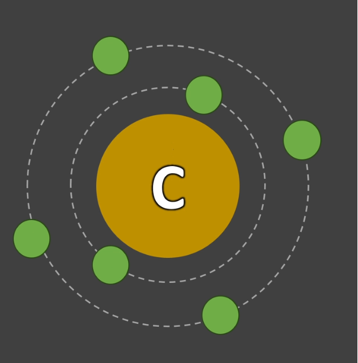

### 1.5.2 分析石墨

* 当出现 2 个原子核的时候，其左边选出 1 个电子，右边也选出 1 个电子，其就组合到一起，如下所示：

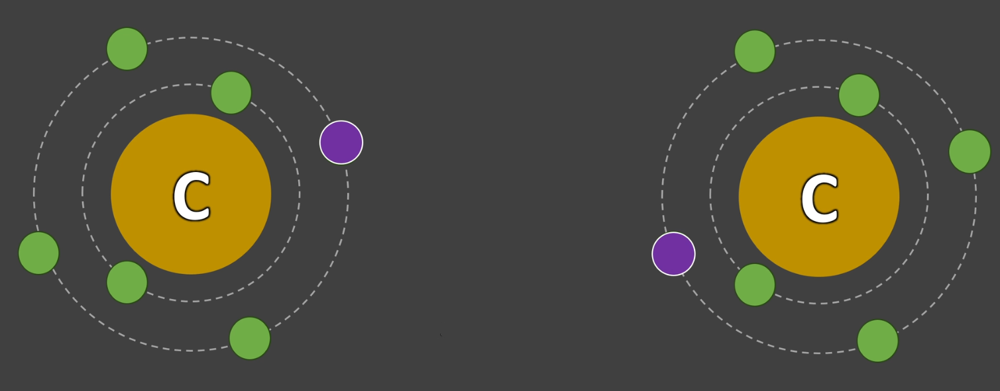

* 上述的 2 个电子形成了了共价键，如下所示：

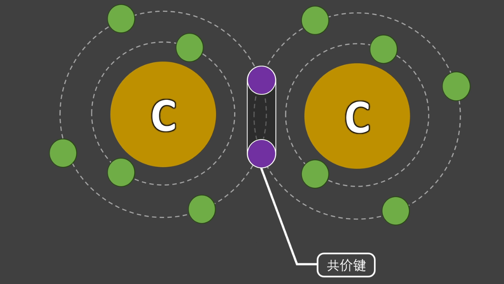

* 我们也知道，原子之间在组合的时候，主要是看最外层的电子；那么，就可以将里层的电子弱化一下，即：置灰。

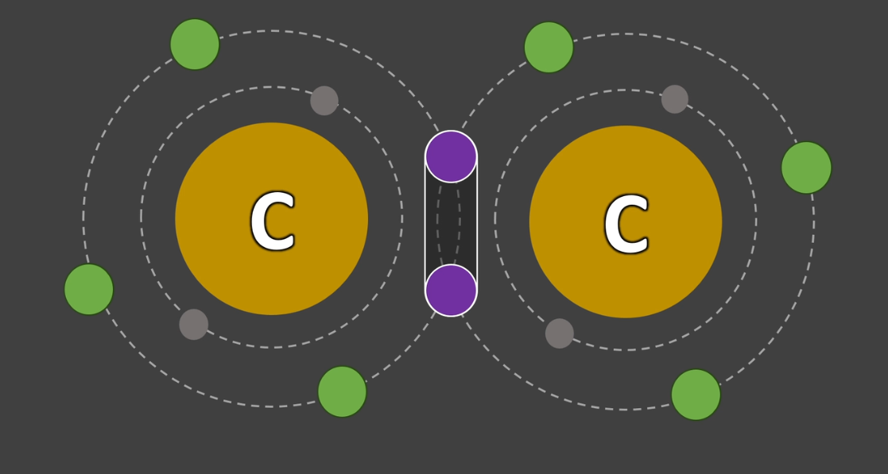

* 以此类推，如果有很多碳原子，也是这样组合的，如下所示：

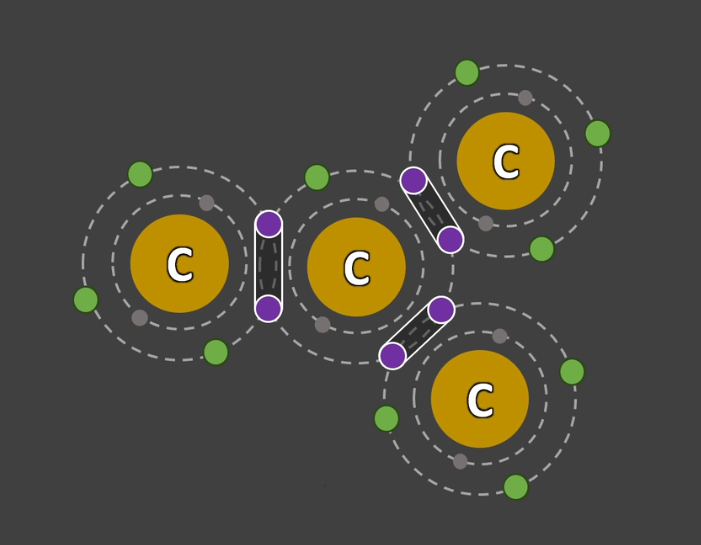

* 对于石墨而言，1 个碳原子会和周围的 3 个碳原子进行结合；并且，我们会发现中间的碳原子的最外层电子会有 1 个没有成对的电子，其是一个自由电子，如下所示：

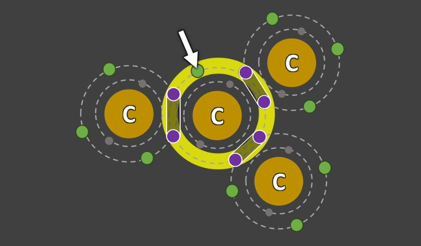

* 自由电子是可以在周围任何一个碳原子的电子层中随意进行穿梭，如下所示：

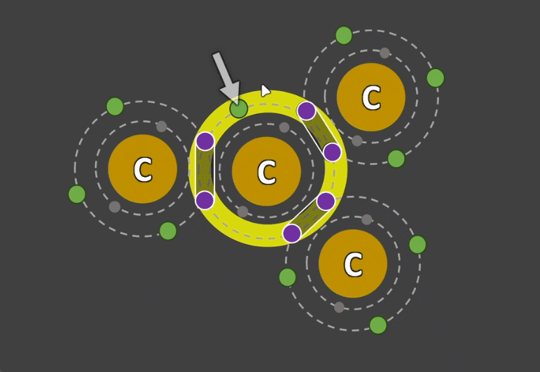

* 石墨的整体原子排列是这样的，如下所示：

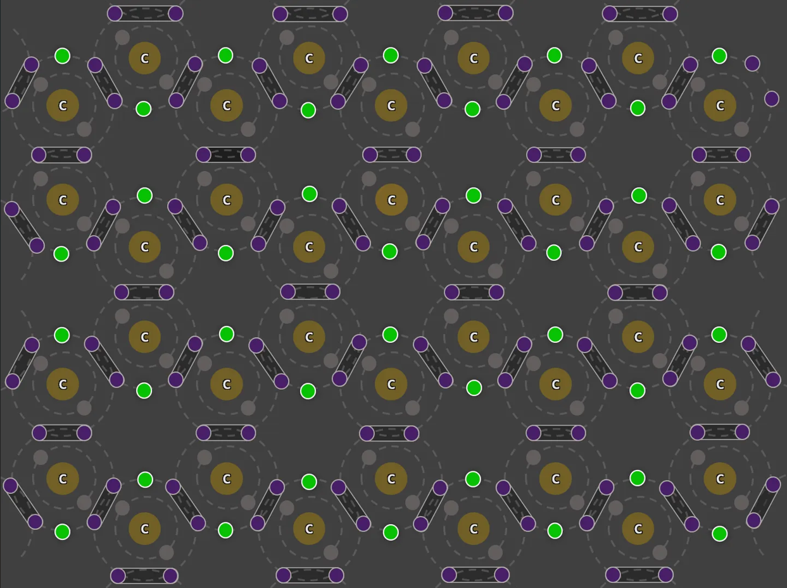

* 又因为每个自由电子都会在周围的碳原子外围穿梭，所以石墨是导电的，如下所示：

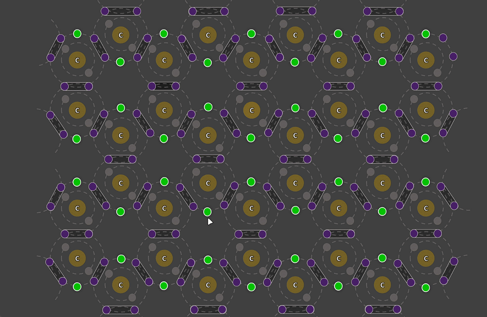

* 继续简化上图，1 个碳原子和 3 个碳原子进行结合，我们就可以使用白线来代替共价键，如下所示：

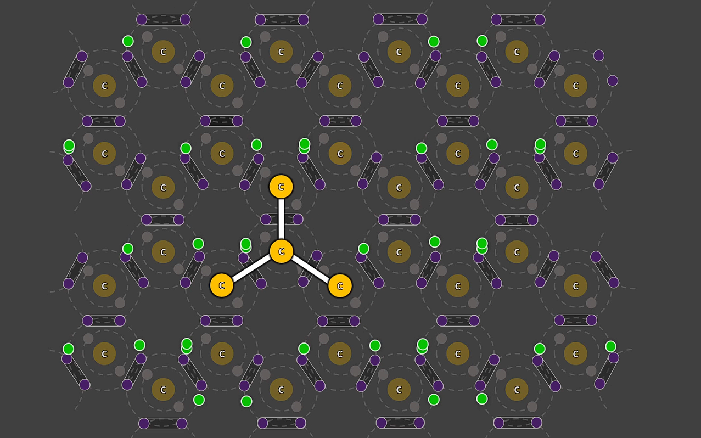

* 那么，对应的简化图就是这样的，这也是很多教科书中给出的图例，如下所示：

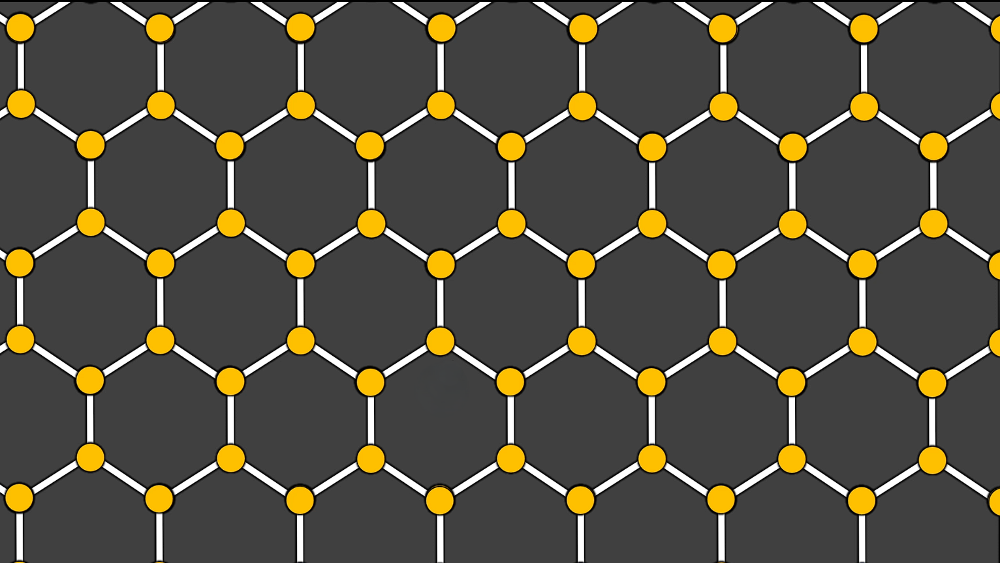

* 但是，石墨是分为很多层的，如下所示：

> [!NOTE]
>
> ⽯墨的层与层之间是靠『范德华⼒』结合在⼀起的，范德华⼒是⼀种弱的分⼦间作用力，因此⽯墨的各个层之间可以很容易地滑动，所以⽯墨可以作为：润滑剂、铅笔芯等。

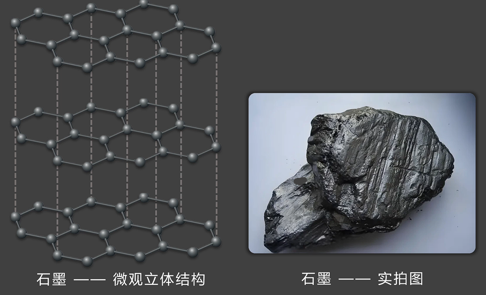

### 1.5.3 分析金刚石

* 直接看金刚石的原子排列，其是 1 个碳原子和周围的 4 个碳原子形成共价键去组合，这样就导致了金刚石中没有自由电子，即：金刚石不导电，如下所示：

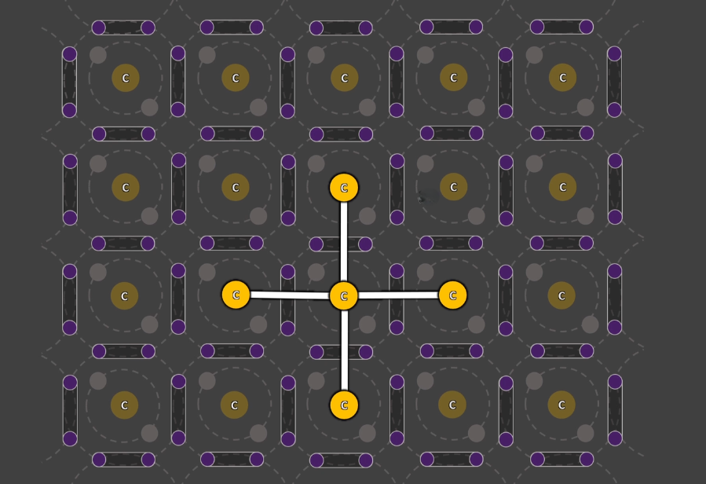

* 和石墨不一样，金刚石是一个立体的结构，其非常稳定并且坚硬，如下所示：

> [!NOTE]
>
> 金刚石中碳原⼦之间共价键内的电⼦活动范围相对较小，且共价键内的电⼦被两个原⼦核共同吸引，所以金刚石中碳原⼦之间共价键内的电⼦相对稳定，不会轻易脱落，除⾮有⾜够的能量来打破这个键。

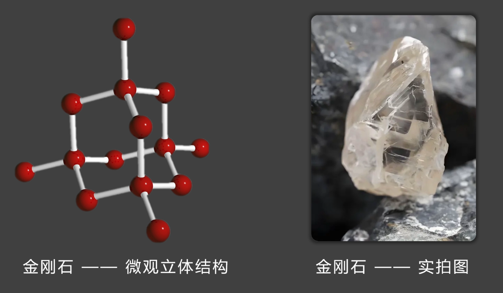

# 第二章：电流、电压以及电阻

## 2.1 

# 第三章：电路相关原理

