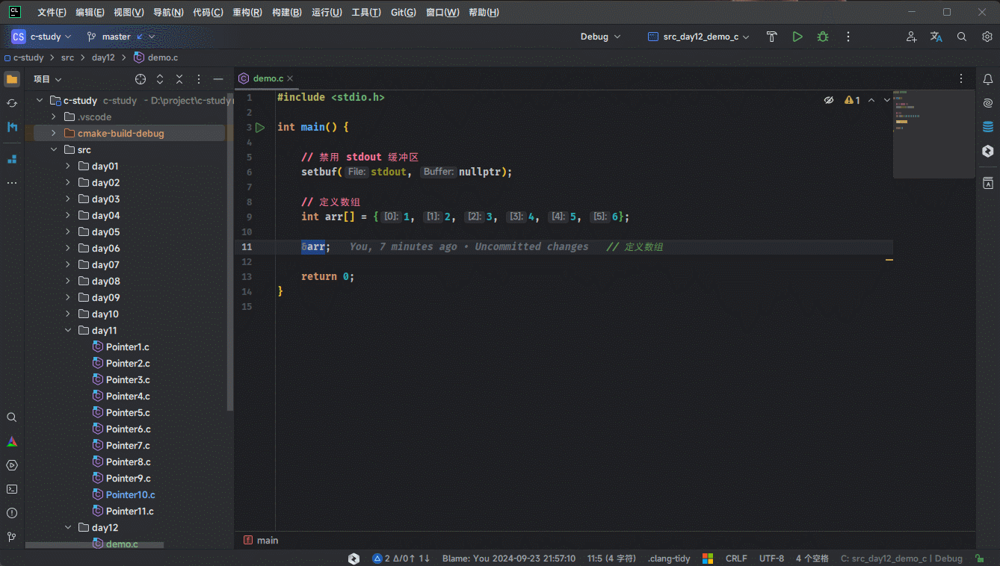
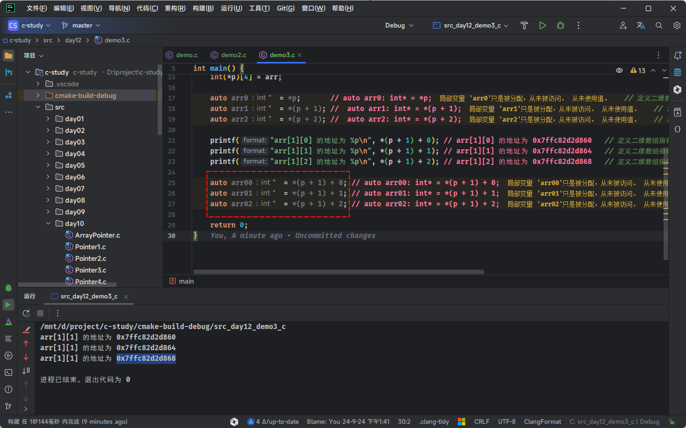

# 第一章：指针数组（⭐）

## 1.1 扫清概念

* `数组指针`（Pointer to an Array）：当指针变量中存放的是一个数组的首地址的时候，就称该指针变量为指向数组的指针变量，简称为`数组指针`。

> [!NOTE]
>
> - ① `数组指针`是`指针变量`，即：指向数组的指针变量，而不是数组。
> - ② 如果整型指针，如：`int *p` ，表示的是指向整型数据的指针变量。那么，数组指针，表示的就是指向数组的指针变量。

> [!NOTE]
>
> ::: details 点我查看 一维数组指针和二维数组指针
>
> * 一维数组指针：指向一维数组的指针（使用居多）。
>
> ```c {2}
> int arr[5] = {1, 2, 3, 4, 5};
> int *p = arr;  // p 是指向 int 类型的指针，指向 arr[0]
> ```
>
> * 二维数组指针：指向二维数组的指针。
>
> ```c {6}
> int arr[3][4] = {
>     {1, 2, 3, 4},
>     {5, 6, 7, 8},
>     {9, 10, 11, 12}
> };
> 
> int (*p)[4] = arr;  // p 是指向包含 4 个整数的数组的指针，指向 arr[0] 
> ```
>
> :::

> [!NOTE]
>
> ::: details 点我查看 一维数组指针的应用场景
>
> **一维数组指针**常用于动态数组、函数参数传递、数组遍历等场景。它简单、高效，尤其适用于处理一维数据结构。
>
> * ① **动态数组管理**：当我们需要在运行时动态分配一维数组的内存时，指针能够提供更大的灵活性，如：使用 `malloc` 或 `new` 动态分配一维数组并通过指针访问。
>
> ```c
> int *arr = (int *)malloc(sizeof(int) * 10);  // 动态分配10个整数的空间
> // 使用指针操作数组
> for (int i = 0; i < 10; i++) {
>     *(arr + i) = i * i;
> }
> free(arr);  // 释放动态内存
> ```
>
> * ② **函数参数传递**：一维数组通常通过指针传递给函数，而不是整个数组。这样可以避免数组复制，提高性能，如：处理数据时通过指针传递数组，减少内存开销。
>
> ```c
> void processArray(int *arr, int size) {
>     for (int i = 0; i < size; i++) {
>         printf("%d ", *(arr + i));
>     }
> }
> int main() {
>     int arr[5] = {1, 2, 3, 4, 5};
>     processArray(arr, 5);  // 传递数组指针
>     return 0;
> }
> ```
>
> * ③ **数组遍历和操作**：当我们需要在一个一维数组上进行遍历和操作时，指针提供了更加灵活的方式，尤其是在处理大型数据时，可以通过指针直接访问内存位置，效率较高。
>
> ```c
> int arr[5] = {1, 2, 3, 4, 5};
> int *p = arr;
> while (p < arr + 5) {
>     printf("%d ", *p);
>     p++;
> }
> ```
>
> * ④ **数组与指针混合使用**：有时数组与指针结合使用，尤其是在处理多维数组时，一维数组指针可以方便地访问和修改数组的元素。这种方式适合在不需要多维数组指针时使用。
>
> ```c
> int arr[3][4] = {
>     {1, 2, 3, 4},
>     {5, 6, 7, 8},
>     {9, 10, 11, 12}
> };
> int *p = &arr[0][0];
> printf("%d\n", *(p + 5));  // 访问 arr[1][1]，值为6
> ```
>
> :::

> [!NOTE]
>
> ::: details 点我查看 二维数组指针的应用场景
>
> **二维数组指针**适合用于处理复杂的二维数据（矩阵、表格、图像等），尤其在需要动态分配内存、优化内存布局时非常有用。
>
> * ① **处理二维动态数组**：当我们需要动态创建二维数组时，使用二维数组指针可以灵活地分配和访问内存，如：创建一个动态的矩阵，在内存中分配一个二维数组的指针并进行操作。
>
> ```c
> int **arr;
> int rows = 3, cols = 4;
> arr = (int **)malloc(rows * sizeof(int *));  // 分配指向行的指针
> for (int i = 0; i < rows; i++) {
>     arr[i] = (int *)malloc(cols * sizeof(int));  // 分配每行的列
> }
> 
> // 填充二维数组
> for (int i = 0; i < rows; i++) {
>     for (int j = 0; j < cols; j++) {
>         arr[i][j] = i * j;
>     }
> }
> 
> // 释放内存
> for (int i = 0; i < rows; i++) {
>     free(arr[i]);
> }
> free(arr);
> ```
>
> * ② **矩阵操作**：在处理矩阵（如图像处理、科学计算、机器学习等领域）时，二维数组指针非常常见。通过二维数组指针可以方便地操作每行的元素。
>
> ```c
> void printMatrix(int (*arr)[4], int rows) {
>     for (int i = 0; i < rows; i++) {
>         for (int j = 0; j < 4; j++) {
>             printf("%d ", arr[i][j]);
>         }
>         printf("\n");
>     }
> }
> 
> int main() {
>     int arr[3][4] = {
>         {1, 2, 3, 4},
>         {5, 6, 7, 8},
>         {9, 10, 11, 12}
>     };
>     printMatrix(arr, 3);  // 输出整个矩阵
>     return 0;
> }
> ```
>
> * ③ **多维数组的处理**：二维数组指针也可以用来处理更高维度的数据。通过指针逐层访问数据，可以处理复杂的数据结构，如：三维数组、四维数组等。
>
> ```c
> void process3DArray(int (*arr)[4][3], int depth) {
>     for (int i = 0; i < depth; i++) {
>         for (int j = 0; j < 4; j++) {
>             for (int k = 0; k < 3; k++) {
>                 printf("%d ", arr[i][j][k]);
>             }
>             printf("\n");
>         }
>     }
> }
> 
> int main() {
>     int arr[2][4][3] = {
>         {{1, 2, 3}, {4, 5, 6}, {7, 8, 9}, {10, 11, 12}},
>         {{13, 14, 15}, {16, 17, 18}, {19, 20, 21}, {22, 23, 24}}
>     };
>     process3DArray(arr, 2);  // 输出三维数组
>     return 0;
> }
> ```
>
> :::

* `指针数组`（Array of Pointers）：数组可以用来存放一系列相同类型的数据，那么数组也可以用来存放指针，这种用来`存放指针的数组`就被称为`指针数组`。

> [!NOTE]
>
> - ① `指针数组`是`数组`，用来存放指针的数组。
> - ② `指针数组`要求存放在数组中的指针的`数据类型必须一致`。

> [!NOTE]
>
> ::: details 点我查看 指针数组的应用场景
>
> * ① **字符数组**：直接定义一个字符数组来存储多个字符串时，每个字符串需要事先指定大小。字符数组内的字符串是固定长度的，通常需要分配一个足够大的内存空间来存储最长的字符串。
>
> ```c
> char strArr[4][20] = {"Hello", "World", "C", "Programming"}; 
> ```
>
> * ② **指针数组**：指针数组更灵活，因为每个指针元素都可以指向不同长度的字符串，且不需要预先知道字符串的长度。
>
> ```c
> char *strArr[] = {"Hello", "World", "C", "Programming"};
> ```
>
> :::

## 1.2 回顾运算符的优先级

* 下面是 C 语言中的运算符及其优先级表：

| 优先级 | 运算符         | 名称或含义                                 | 结合方向      |
| :----- | :------------- | :----------------------------------------- | :------------ |
| `0`    | `()`           | 小括号，最高优先级                         | ➡️（从左到右） |
| `1`    | `++`、`--`     | 后缀自增和自减，如：`i++`、`i--` 等        | ➡️（从左到右） |
|        | `()`           | 小括号，函数调用，如：`sum(1,2)` 等        |               |
|        | `[]`           | 数组下标，如：`arr[0]`、`arr[1]` 等        |               |
|        | `.`            | 结构体或共用体成员访问                     |               |
|        | `->`           | 结构体或共用体成员通过指针访问             |               |
| `2`    | `++`、`--`     | 前缀自增和自减，如：`++i`、`--i` 等        | ⬅️（从右到左） |
|        | `+`            | 一元加运算符，表示操作数的正，如：`+2` 等  |               |
|        | `-`            | 一元减运算符，表示操作数的负，如：`-3` 等  |               |
|        | `!`            | 逻辑非运算符（逻辑运算符）                 |               |
|        | `~`            | 按位取反运算符（位运算符）                 |               |
|        | `（typename）` | 强制类型转换                               |               |
|        | `*`            | 解引用运算符                               |               |
|        | `&`            | 取地址运算符                               |               |
|        | `sizeof`       | 取大小运算符                               |               |
| `3`    | `/`            | 除法运算符（算术运算符）                   | ➡️（从左到右） |
|        | `*`            | 乘法运算符（算术运算符）                   |               |
|        | `%`            | 取模（取余）运算符（算术运算符）           |               |
| `4`    | `+`            | 二元加运算符（算术运算符），如：`2 + 3` 等 | ➡️（从左到右） |
|        | `-`            | 二元减运算符（算术运算符），如：`3 - 2` 等 |               |
| `5`    | `<<`           | 左移位运算符（位运算符）                   | ➡️（从左到右） |
|        | `>>`           | 右移位运算符（位运算符）                   |               |
| `6`    | `>`            | 大于运算符（比较运算符）                   | ➡️（从左到右） |
|        | `>=`           | 大于等于运算符（比较运算符）               |               |
|        | `<`            | 小于运算符（比较运算符）                   |               |
|        | `<=`           | 小于等于运算符（比较运算符）               |               |
| `7`    | `==`           | 等于运算符（比较运算符）                   | ➡️（从左到右） |
|        | `!=`           | 不等于运算符（比较运算符）                 |               |
| `8`    | `&`            | 按位与运算符（位运算符）                   | ➡️（从左到右） |
| `9`    | `^`            | 按位异或运算符（位运算符）                 | ➡️（从左到右） |
| `10`   | `\|`           | 按位或运算符（位运算符）                   | ➡️（从左到右） |
| `11`   | `&&`           | 逻辑与运算符（逻辑运算符）                 | ➡️（从左到右） |
| `12`   | `\|\|`         | 逻辑或运算符（逻辑运算符）                 | ➡️（从左到右） |
| `13`   | `?:`           | 三目（三元）运算符                         | ⬅️（从右到左） |
| `14`   | `=`            | 简单赋值运算符（赋值运算符）               | ⬅️（从右到左） |
|        | `/=`           | 除后赋值运算符（赋值运算符）               |               |
|        | `*=`           | 乘后赋值运算符（赋值运算符）               |               |
|        | `%=`           | 取模后赋值运算符（赋值运算符）             |               |
|        | `+=`           | 加后赋值运算符（赋值运算符）               |               |
|        | `-=`           | 减后赋值运算符（赋值运算符）               |               |
|        | `<<=`          | 左移后赋值运算符（赋值运算符）             |               |
|        | `>>=`          | 右移后赋值运算符（赋值运算符）             |               |
|        | `&=`           | 按位与后赋值运算符（赋值运算符）           |               |
|        | `^=`           | 按位异或后赋值运算符（赋值运算符）         |               |
|        | `\|=`          | 按位或后赋值运算符（赋值运算符）           |               |
| `15`   | `,`            | 逗号运算符                                 | ➡️（从左到右） |

> [!NOTE]
>
> * ① `()` 比 `[]` 的优先级大，结合方向是从`左`到`右`，如：`int (*p)[6]`，编译器会先解析 `(*p)`，表明 `p` 是一个`指针变量`；再解析 `int[6]`，表示 `p` 是一个指向包含 `6` 个 `int` 类型数组的`指针变量`。
> * ② `*` 比 `[]` 的优先级低，如：`int *p[6]` ，相当于 `int *(p[6])`，编译器会先解析 `p[6]`，表明 `p` 是包含 `6` 的元素的`数组`；再解析 `int*`，表示 `p` 数组中的元素全是 `int *` 类型。 

## 1.3 指针数组的声明和初始化

* 语法：

```c
数组类型 *数组名[长度] = {&变量1,&变量2,...};
```

> [!NOTE] 
>
> 由于 `[]` 的优先级比`*` 大，`数据类型 *数组名[长度]`就类似于 `数据类型 *(数组名[长度])`。

> [!NOTE]
>
> ::: details 点我查看 对应的内存示意图
>
> 
>
> :::


* 示例：

```c {17,24}
#include <stdio.h>

int main() {
    // 禁用 stdout 缓冲区
    setbuf(stdout, nullptr);

    // 定义整数
    int a = 10;
    int b = 20;
    int c = 30;

    // 定义一个 int 类型的指针数组
    /**
    * 静态初始化的时候，可以省略长度。
    * 因为编译器会根据初始化的元素自动推断出数组元素的个数
    */
    int *arr[] = {&a, &b, &c};

    // 计算指针数组的长度
    int len = sizeof(arr) / sizeof(arr[0]);

    // 遍历数组中的元素
    for (int i = 0; i < len; ++i) {
        printf("arr[%d] = %d\n", i, *arr[i]);
    }

    return 0;
}
```


* 示例：

```c {13,16-18}
#include <stdio.h>

int main() {
    // 禁用 stdout 缓冲区
    setbuf(stdout, nullptr);

    // 定义数组
    int a[] = {1, 2, 3, 4};
    int b[] = {5, 6, 7, 8};
    int c[] = {8, 9, 10, 11};

    // 定义指针数组
    int *arr[3];

    // 给指针数组赋值
    arr[0] = a;
    arr[1] = b;
    arr[2] = c;

    // 遍历指针数组
    for (int i = 0; i < 3; i++) {
        for (int j = 0; j < 4; j++) {
            printf("%d ", arr[i][j]);
        }
        printf("\n");
    }

    return 0;
}
```


* 示例：

```c {25,29}
#include <stdio.h>

int main() {
    // 禁用 stdout 缓冲区
    setbuf(stdout, nullptr);

    // 定义整数
    int a = 10;
    int b = 20;
    int c = 30;

    // 定义一个 int 类型的指针数组
    /**
     * 静态初始化的时候，可以省略长度。
     * 因为编译器会根据初始化的元素自动推断出数组元素的个数
     */
    int *arr[] = {&a, &b, &c};

    // 计算指针数组的长度
    int len = sizeof(arr) / sizeof(arr[0]);

    // 定义一个二级指针指向指针数组
    // 数组名 arr 会转换为数组中的第 0 个元素
    // 又因为数组 arr 中的元素都是指针，所以 p 需要定义为二级指针
    int **p = arr;

    // 遍历数组中的元素
    for (int i = 0; i < len; ++i) {
        printf("arr[%d] = %d\n", i, **(p+i));
    }

    return 0;
}
```

## 1.4 字符串指针数组

* 对于普通的字符串，在定义的时候，可以将其赋值给普通的指针变量，如下所示：

```c {8,11}
#include <stdio.h>

int main() {
    // 禁用 stdout 缓冲区
    setbuf(stdout, nullptr);

    // 字符串指针所指向的字符串，即：常量区中的字符串
    char *str = "Hello World";

    // 打印字符串
    printf("%s\n", str);

    return 0;
}
```

* 那么，对于多个字符串，在定义的时候，就可以使用字符串指针数组，如下所示：

```c {12,19}
#include <stdio.h>

int main() {
    // 禁用 stdout 缓冲区
    setbuf(stdout, nullptr);

    // 字符串指针所指向的字符串，即：常量区中的字符串
    char *str  = "Hello";
    char *str2 = "World";

    // 定义字符串指针数组
    char *strArr[] = {str, str2};

    // 计算字符穿指针数组的长度
    int len = sizeof(strArr) / sizeof(strArr[0]);

    // 打印字符串
    for (int i = 0; i < len; i++) {
        printf("%s\n", strArr[i]);
    }

    return 0;
}
```

* 当然，在静态初始化字符串指针数组，还有简化写法，如下所示：

```c {8}
#include <stdio.h>

int main() {
    // 禁用 stdout 缓冲区
    setbuf(stdout, nullptr);

    // 定义字符串指针数组
    char *strArr[] = {"Hello", "World"};

    // 计算字符穿指针数组的长度
    int len = sizeof(strArr) / sizeof(strArr[0]);

    // 打印字符串
    for (int i = 0; i < len; i++) {
        printf("%s\n", strArr[i]);
    }

    return 0;
}
```


# 第二章：二维数组指针（⭐）

## 2.1 知识点串烧

### 2.1.1 内存地址和指针变量

* `普通变量`所对应的内存空间`存储`的是`普通的值`，如：整数、小数、字符等，如下所示：

> [!NOTE]
>
> ::: details 点我查看 普通变量对应的内存示意图
>
> 
>
> :::

* `指针变量`所对应的内存空间`存储`的是另外一个变量的`内存地址`（指针），如下所示：

> [!NOTE]
>
> ::: details 点我查看 指针变量对应的内存示意图
>
> 
>
> :::

### 2.1.2 从编译器的角度看普通变量和指针变量

- 编程语言的目的就是为了将`计算机指令（机器语言）`抽象为人类能够理解的`自然语言`，让程序员能够更加容易，去管理和操作计算机中的各种资源，如：CPU、内存、硬盘等，这些`计算机资源`最终表现为`编程语言`中的各种`符号`和`语法规则`。
- 对于下面的代码，如下所示：

```c
#include <stdio.h>

int main(){
    
    int num = 10;
    
    float f = 3.14;
    
    int arr[5] = {1,2,3,4,5};
    
    int *p = &arr[0];
    
    return 0;
}
```

* `编译器`在`编译过程`中会维护一种`数据结构`，通常称为`符号表`，如下所示：

| 变量名称 | 数据类型 | 大小（字节） | 内存地址     | 作用域         | 初始值                            |
| :------- | :------- | :----------- | :----------- | :------------- | :-------------------------------- |
| `num`    | `int`    | 4            | `0x7ffeabc0` | 局部（函数内） | `10`                              |
| `f`      | `float`  | 4            | `0x7ffeabc4` | 局部（函数内） | `3.14`                            |
| `arr`    | `int[5]` | 20           | `0x7ffeabc8` | 局部（函数内） | `{1,2,3,4,5}`                     |
| `p`      | `int*`   | 8            | `0x7ffeabcc` | 局部（函数内） | `0x7ffeabc8`（指向 `arr` 的地址） |

> [!NOTE]
>
> - ① 符号表用于存储程序中所有标识符的信息，包括：变量名、函数名、类型、作用域以及在内存中的地址等。
> - ② 在编译过程中，当编译器遇到一个标识符时，它会查找符号表，以确认这个标识符的属性。这使得程序员在编写代码时可以使用易于理解的名字，而不需要关心底层的内存地址和数据布局。
> - ③ `sizeof` 操作符通过查询符号表，能够获取到标识符所对应的数据类型的大小（以字节为单位）。因此，程序员只需使用 `sizeof` 来获取数据类型的大小，而不必自己去计算或查找其在内存中的占用。

> [!IMPORTANT]
>
> -  符号表在编译器中起到桥梁的作用，使得高级语言的抽象能够有效地转化为底层机器能够理解的指令和内存布局。
> - ② 这种机制提高了编程的效率和安全性，让程序员能够专注于逻辑而非内存管理。

> [!NOTE]
>
> - ① 但是，和普通变量名相比，数组名就既有“一般性”，也有“特殊性”。
> - ② 所谓的“一般性”，就是数组名和普通变量类似，是用来代替特定的内存空间的存储区域，有自己的类型和长度，如：`int arr[5] = {1, 2, 3, 4, 5};` 中的 `arr` 就是一个`数组名`，它的类型是 `int[5]` ，它的长度是 `5 × 4 = 20` 。
> - ③ 所谓的“特殊性”，就是数组名在大多数情况下会被隐式转换为指向其第一个元素的指针，也被称为“数组到指针的衰退”，这就意味着：数组名本身并不是直接表示数组的所有值，而是指向数组第一个元素的地址。

### 2.1.3 再谈`数组名`和`&数组名`

* C 语言标准规定：当数组名作为数组定义的标识符，即：定义或声明数组时，遇到 `sizeof` 运算符或 `&` 操作符的时候，数组名代表整个数组；否则，数组名会被转换为指向第 `0` 个元素的指针（地址）。


* 示例：

```c
int arr[3] = {1,2,3}; // arr 的数据类型就是 int[3]

// 因为 arr 在参与运算的时候，会转换为数组的第 0 个元素的地址，即：arr == &arr[0]]
// arr[0] 获取的是数组第 0 个索引上的值，其数据类型是 int，
// &arr[0] 获取的是数组第 0 个索引上的内存地址，因为 arr[0] 的数据类型是 int，
// 所以，&arr[0] 的数据类型就是指向 int 类型的指针，即：int*
// 所以，arr 的数据类型也是 int* 
int* p = arr;  // p 的类型是 int *
```


* 示例：

```c
int arr[3] = {1,2,3}; // arr 的数据类型就是 int[3]

// 当 arr 遇到 & 运算符的时候，它表示整个数组的地址，而不是数组的第 0 个元素的地址。
// 由于 &arr 是数组本身的地址，&arr 就是指向 int[3] 的指针，即：int(*)[3]
int (*p)[3] = &arr; // p 的类型是 int(*)[3]
```

## 2.2 CLion 中如何查看`数组名`或 `&数组名`的数据类型

### 2.2.1 通用解决方案（主流 IDE 都支持）

* 直接在变量名之前使用 `auto` 关键字，而不写变量名真正的数据类型，让 CLion 帮助我们来推断出其真正的数据类型，如下所示：

```c {12-13}
#include <stdio.h>

int main() {

    // 禁用 stdout 缓冲区
    setbuf(stdout, nullptr);

    // 定义数组
    int arr[] = {1, 2, 3, 4, 5, 6};
   
    // 使用 auto 关键字让 IDE 帮助我们来推断数组名和&数组名真正的数据类型
    auto p = arr;
    auto p2 = &arr;

    return 0;
}
```

* 在 CLion 中，我们可以观察其真正的类型，如下所示：


### 2.2.2 针对 `&数组名`的数据类型（仅限 CLion）

* 对于 `&数组名` 的数据类型，因为其数据类型永远是固定的，即：`int(*)[len]`。此时，就可以使用 CLion `自动提取变量的数据类型`的`快捷键`（ `Ctrl + Alt + V` ）来自动补全变量和其对应的数据类型，如下所示：



## 2.3 回顾二维数组

* 在 C 语言中，所谓的`二维数组`就是`数组中的数组`。
* 二维数组在`逻辑结构`上是可以用来作为`行列关系`的`矩阵`，如下所示：


* 但是，二维数组在`物理结构`（内存）上是`线性`的，如下所示：


> [!NOTE]
>
> * ① 逻辑结构主要关注数据元素之间的逻辑关系，而物理结构主要关注数据的具体存储方式。
> * ② 逻辑结构更加抽象，更注重于问题的解决思路；而物理结构更加具体，更注重于实现细节。

> [!CAUTION]
>
> 逻辑结构和物理结构并不是相互独立的，它们相互影响，相互制约！！！

## 2.4 二维数组指针

### 2.4.1 概述

* 之前提过，数组也是有类型的，如果我们将 `int`、`float` 、`char` 等理解为`基本数据类型`。那么，`数组`就可以理解为由基本类型派生得到的稍微复杂一些的类型。

> [!NOTE]
>
> `sizeof` 就是根据符号的类型来计算长度的，其实是查询的符号表！！！

* 假设一维数组和指针变量的定义，如下所示：

```c
int arr[3] = {1,2,3}; // arr 的数据类型就是 int[3]

int* p = arr; // p 的数据类型就是 int*
```

> [!NOTE]
>
> * ① 对于一维数组 `arr` 而言，它的数据类型就是 `int[3]`，所以 `sizeof(arr)` 获取其长度就是 `4 × 3 = 12` 个字节。
> * ② 对于指针变量 `p` 而言，它的数据类型就是 `int*`，所以 `sizeof(p)`获取其长度，在 `32` 位操作系统上就是 `4` 个字节，在 `64` 位操作系统上就是 `8` 个字节。

* 假设二维数组的定义，如下所示：

```c
int arr[3][4] = {{1,2,3,4},{5,6,7,8},{9,10,11,12}};
```

> [!NOTE]
>
> * ① 根据上面的结论，我们可以推断，对于二维数组 `arr` 而言，它的数据类型就是 `int[3][4]`，所以 `sizeof(arr)` 获取其长度就是 `4 × 3 × 4 = 48` 个字节。
> * ② 对于一维数组，数组名 `arr` 是一个指向 `int` 类型的指针，因此可以赋值给 `int*` 类型的指针。但是，对于二维数组，数组名 `arr` 是一个指针 `int[4]` 类型的指针，它不能直接赋值给 `int *` 类型的指针，需要使用 `int (*)[4]` 类型的指针来接收，才能正确表示二维数组的结构。

### 2.4.2 二维数组指针

* C 语言允许将一个二维数组分解为多个一维数组来处理，如下所示：

```c
int arr[3][4] = {{1,2,3,4},{5,6,7,8},{9,10,11,12}};
```

> [!NOTE]
>
> * ① 对于二维数组 `arr` ，它可以被拆分为 `3` 个一维数组，即：`arr[0]`、`arr[1]`、`arr[2]`。
> * ② 对于每个被拆分的一维数组，都包含 `4` 个元素，如：`arr[0]` 包含了 `arr[0][0]`、 `arr[0][1]`、 `arr[0][2]`。

> [!IMPORTANT]
>
> * ① 为了能够通过指针来遍历数组元素，在定义数组指针时需要进行降维处理，如：三维数组指针实际指向的数据类型是二维数组，二维数组指针实际指向的数据类型是一维数组，一维数组指针实际指向的是一个基本类型。
> * ② 在表达式中，数组名也会进行同样的转换（下降一维）。

* 那么，二维数组 `arr` 在逻辑上就是这样的，如下所示：


* 那么，可以大胆的猜测，`arr` 的数据类型就是 `int (*)[4]`，如下所示：

```c
int arr[3][4] = {{1,2,3,4},{5,6,7,8},{9,10,11,12}};

int (*p)[4] = arr;·
```

>[!NOTE]
>
>* ① 数组名 `arr` 参与计算的时候会转换为数组的第 `0` 个元素的地址，即：`arr = &arr[0]`。
>* ② 因为 `arr` 是二维数组，那么在转换为数组的第 `0` 个元素的地址的时候，其实转换的就是第 `0` 个子数组的地址。
>* ③ 由于， `&arr[0]` 被视为第 `0` 个子数组本身，而每个子数组有 `4` 个元素，它的数据类型就是 `int[4]`，那么 `&arr[0]` 就是指向 `int[4]` 的指针，即：`int (*)[4]`。
>* ④ 所以，`arr` 的数据类型就是 `int (*)[4]`。

> [!IMPORTANT]
>
> * ① 为了能够通过指针来遍历数组元素，在定义数组指针时需要进行降维处理，如：三维数组指针实际指向的数据类型是二维数组，二维数组指针实际指向的数据类型是一维数组，一维数组指针实际指向的是一个基本类型。
> * ② 在表达式中，数组名也会进行同样的转换（下降一维）。

### 2.4.3 `二维数组指针 ± n`

* 指针变量 `p` 和数组名 `arr` ，在内存中上就是这样的，如下所示：


> [!NOTE]
>
> * ① 数组名 `arr` 在表达式中会转换为和指针变量 `p` 等价的指针。
> * ③ 换言之，数组名 `arr` 在表达式中转换之后的数据类型就是 `int (*)[4]`。

* 指针变量 `p` 指向二维数组 `arr` 的第 `0` 个子数组的首地址，即：第 `0` 行。`p + 1` 就是前进 `1` 行，指向二维数组 `arr` 第 `1` 个子数组的首地址，即：第 `1` 行。同理，`p + 2` 就是前进 `2` 行，指向二维数组 `arr` 第 `2` 个子数组的首地址，即：第 `2` 行。

```c {18,51}
#include <stddef.h>
#include <stdio.h>

#define BOOL_TO_STRING(x) ((x) ? "true" : "false")
int main() {
    // 禁用 stdout 缓冲区
    setbuf(stdout, nullptr);

    int arr[3][4] = {
        {1, 2, 3, 4},
        {11, 22, 33, 44},
        {111, 222, 333, 444}};

    // arr == &arr[0]: true
    printf("arr == &arr[0]: %s\n\n", BOOL_TO_STRING(arr == &arr[0]));

    // 定义二维数组指针
    int(*p)[4] = arr;

    // p = 0x7ffcb723ad30
    printf("p = %p\n", p);
    // arr = 0x7ffcb723ad30
    printf("arr = %p\n", arr);
    // &arr = 0x7ffcb723ad30
    printf("&arr = %p\n", &arr);
    // p == arr == &arr: true
    printf("p == arr == &arr: %s\n\n", 
           BOOL_TO_STRING(p == arr && p == &arr[0]));

    // p+1 = 0x7ffcb723ad40
    printf("p+1 = %p\n", p + 1);
    // arr+1 = 0x7ffcb723ad40
    printf("arr+1 = %p\n", arr + 1);
    // &arr+1 = 0x7ffcb723ad60
    printf("&arr+1 = %p\n", &arr + 1);
    // p+1 == arr+1 == &arr+1: true
    printf("p+1 == arr+1 == &arr+1: %s\n\n", 
           BOOL_TO_STRING((p + 1) == (arr + 1) && (p + 1) == (&arr[0] + 1)));

    // p+2 = 0x7ffcb723ad50
    printf("p+2 = %p\n", p + 2);
    // arr+2 = 0x7ffcb723ad50
    printf("arr+2 = %p\n", arr + 2);
    // &arr+2 = 0x7ffcb723ad90
    printf("&arr+2 = %p\n", &arr + 2);
    // p+2 == arr+2 == &arr+2:: true
    printf("p+2 == arr+2 == &arr+2: %s\n\n", 
           BOOL_TO_STRING((p + 2) == (arr + 2) && (p + 2) == (&arr[0] + 2)));

    // 计算内存地址之差
    ptrdiff_t diff = (char *)p + 1 - (char *)p;
    // p + 1 和 p 相差了：1 字节
    printf("p + 1 和 p 相差了：%td 字节\n", diff); 

    return 0;
}
```

* 在 CLion 中验证 `p` 、`p+1` 和 `p+2` 的数据类型，如下所示：

> [!NOTE]
>
> ::: details 点我查看 对应的代码
>
> ```c {14-16}
> #include <stddef.h>
> #include <stdio.h>
> 
> #define BOOL_TO_STRING(x) ((x) ? "true" : "false")
> int main() {
>     // 禁用 stdout 缓冲区
>     setbuf(stdout, nullptr);
> 
>     int arr[3][4] = {
>         {1, 2, 3, 4},
>         {11, 22, 33, 44},
>         {111, 222, 333, 444}};
> 
>     auto p  = arr;   // auto p:int(*)[4]  = arr;
>     auto p2 = p + 1; // auto p2:int(*)[4] = p + 1;
>     auto p3 = p + 2; // auto p3:int(*)[4] = p + 2;
> 
>     return 0;
> }
> ```
> :::


### 2.4.4 `*(二维数组指针 ± n)`

* 对于 `p+1`指针而言，指向的是二维数组中 `arr[1]` 这个一维数组，如下所示：

 

> [!NOTE]
>
> * ① `p+1` 实际上是指向 `arr[1]` 的指针变量，`*(p+1)`中的 `*`是解引用，得到的是 `arr[1]`，即：第 `1` 行数据，而不是第 `1` 行的第 `0` 个元素，在 `printf` 中 `arr[1]` 会退化为 `arr[1]` 数组的首地址，即 `&arr[1][0]` 。
> * ① `p+1 = &arr[1]`。
> * ② `*(p+1) = *&arr[1] = arr[1]`。

* 可以通过下面的运行结果来证明：

```c {24,29}
#include <stddef.h>
#include <stdio.h>

#define BOOL_TO_STRING(x) ((x) ? "true" : "false")
int main() {
    // 禁用 stdout 缓冲区
    setbuf(stdout, nullptr);

    int arr[3][4] = {
        {1, 2, 3, 4},
        {11, 22, 33, 44},
        {111, 222, 333, 444}};

    // 定义二维数组指针
    int(*p)[4] = arr;

    // arr[1] 的地址为 0x7ffeaccdbc00
    printf("arr[1] 的地址为 %p\n", p + 1);
    // arr[1] 的地址为 0x7ffeaccdbc00
    printf("arr[1] 的地址为 %p\n", &arr[1]);
    // arr[1] 的地址为 0x7ffeaccdbc00
    printf("arr[1] 的地址为 %p\n", *&arr[1]);
    // arr[1] 的地址为 0x7ffeaccdbc00
    printf("arr[1] 的地址为 %p\n\n", *(p + 1));

    // arr[1] 在内存中占据的存储单元是: 16 字节
    // *(p + 1) 是 16 ，证明了 *(p + 1) 是一维数组而不是指针
    // 如果是指针，那么就只能是 4 或 8 ，这边的 16 = 4 * 4
    printf("arr[1] 在内存中占据的存储单元是: %zu 字节\n", sizeof(*(p + 1)));
    // arr[1] 在内存中占据的存储单元是: 16 字节
    printf("arr[1] 在内存中占据的存储单元是: %zu 字节\n", sizeof(arr[1]));

    return 0;
}
```

* 既然，`*(p + 1)` 是一维数组 `arr[1]` ，`*(p + 0)` 就是一维数组 `arr[0]`，而 `*(p + 2)`就是一维数组 `arr[2]`，我们可以通过 CLion 来给我们证明，如下所示：

> [!NOTE]
>
> ::: details 点我查看 对应的代码
>
> ```c {17-19}
> #include <stddef.h>
> #include <stdio.h>
> 
> #define BOOL_TO_STRING(x) ((x) ? "true" : "false")
> int main() {
>     // 禁用 stdout 缓冲区
>     setbuf(stdout, nullptr);
> 
>     int arr[3][4] = {
>         {1, 2, 3, 4},
>         {11, 22, 33, 44},
>         {111, 222, 333, 444}};
> 
>     // 定义二维数组指针
>     int(*p)[4] = arr;
> 
>     auto arr0 = *p;       // auto arr0: int* = *p;
>     auto arr1 = *(p + 1); //  auto arr1: int* = *(p + 1);
>     auto arr2 = *(p + 2); //  auto arr2: int* = *(p + 2);
> 
>     return 0;
> }
> ```
> :::


> [!NOTE]
>
> 一维数组指针变量，可以这样赋值的，如下所示：
>
> ```c
> int arr[] = {1,2,3,4,5};
> 
> int *p = arr;
> ```

* 对于一维数组指针变量 `p±n` ，如下所示：

```c
#include <stddef.h>
#include <stdio.h>

int main() {
    // 禁用 stdout 缓冲区
    setbuf(stdout, NULL);

    // 定义普通数组
    int arr[] = {1, 2, 3, 4, 5, 6};

    // 计算数组的长度
    int len = sizeof(arr) / sizeof(int);

    // 将 arr 的地址赋值给 p
    int *p = arr; // 数组名在运算的时候，会转换为数组第 0 个元素的地址

    // 使用指针方式遍历数组
    for (int i = 0; i < len; i++) {
        printf("arr[%d] = %d\n", i, *(p + i));
    }

    return 0;
}
```

* 在内存中就是这样的，如下所示：


* 对于二维数组 `arr` 而言，有 `3` 个一维数组，分别是 `arr[0]`、`arr[1]`、`arr[2]`。`arr[1]` 就是一维数组名，其可以赋值给一维数组指针变量 `p2`，即：`int *p2 = arr[1]` ，对于一维数组指针变量 `p2`，和整数 `n` 进行加减运算的时候，`p2 ± n`表示所指向的内存地址（`+`，表示向`后`移动；`-`，表示向`前`移动）移动了 `n` 个步长。又因为 `*(p+1)` 就是 `arr[1]`。所以，`*(p+1) ± n` 表示 `arr[1][n]` 的地址，如下所示：

```c {18,20,22}
#include <stddef.h>
#include <stdio.h>

#define BOOL_TO_STRING(x) ((x) ? "true" : "false")
int main() {
    // 禁用 stdout 缓冲区
    setbuf(stdout, nullptr);

    int arr[3][4] = {
        {1, 2, 3, 4},
        {11, 22, 33, 44},
        {111, 222, 333, 444}};

    // 定义二维数组指针
    int(*p)[4] = arr;

    // arr[1][0] 的地址为 0x7ffc82d2d860
    printf("arr[1][0] 的地址为 %p\n", *(p + 1) + 0); 
    // arr[1][1] 的地址为 0x7ffc82d2d864
    printf("arr[1][1] 的地址为 %p\n", *(p + 1) + 1); 
    // arr[1][2] 的地址为 0x7ffc82d2d868
    printf("arr[1][2] 的地址为 %p\n", *(p + 1) + 2); 

    return 0;
}
```

* 对于指针变量 `*(p+1) ± n` ，在内存中就是这样的，如下所示：


* 我们可以通过 CLion 来给我们证明，如下所示：

> [!NOTE]
>
> ::: details 点我查看 对应的代码
>
> ```c {28-30}
> #include <stddef.h>
> #include <stdio.h>
> 
> #define BOOL_TO_STRING(x) ((x) ? "true" : "false")
> int main() {
>     // 禁用 stdout 缓冲区
>     setbuf(stdout, nullptr);
> 
>     int arr[3][4] = {
>         {1, 2, 3, 4},
>         {11, 22, 33, 44},
>         {111, 222, 333, 444}};
> 
>     // 定义二维数组指针
>     int(*p)[4] = arr;
> 
>     auto arr0 = *p;       // auto arr0: int* = *p;
>     auto arr1 = *(p + 1); //  auto arr1: int* = *(p + 1);
>     auto arr2 = *(p + 2); //  auto arr2: int* = *(p + 2);
> 
>     // arr[1][0] 的地址为 0x7ffc82d2d860
>     printf("arr[1][0] 的地址为 %p\n", *(p + 1) + 0); 
>     // arr[1][1] 的地址为 0x7ffc82d2d864
>     printf("arr[1][1] 的地址为 %p\n", *(p + 1) + 1); 
>     // arr[1][2] 的地址为 0x7ffc82d2d868
>     printf("arr[1][2] 的地址为 %p\n", *(p + 1) + 2); 
> 
>     auto arr00 = *(p + 1) + 0; // auto arr00: int* = *(p + 1) + 0;
>     auto arr01 = *(p + 1) + 1; // auto arr01: int* = *(p + 1) + 1;
>     auto arr02 = *(p + 1) + 2; // auto arr02: int* = *(p + 1) + 2;
> 
>     return 0;
> }
> ```
> :::



### 2.4.5 `*(*(二维数组指针 ± n))`

* 既然 `*(p+1) ± n` 表示第 1 行第 n 列元素的地址，那么 `*(*(p+1) ± n)`就表示第 1 行第 n 列元素的值。


* 示例：

```c
#include <stdio.h>

int main() {
    // 禁用 stdout 缓冲区
    setbuf(stdout, nullptr);

    // 定义二维数组
    int arr[3][4] = {{1, 2, 3, 4}, {5, 6, 7, 8}, {9, 10, 11, 12}};

    // 定义二维数组指针
    int(*p)[4] = arr;

    // arr[1][1] 的地址为 0x7ffd10d20f74
    printf("arr[1][1] 的地址为 %p\n", &arr[1][1]);   
    // arr[1][1] 的地址为 0x7ffd10d20f74
    printf("arr[1][1] 的地址为 %p\n", arr[1] + 1);   
    // arr[1][1] 的地址为 0x7ffd10d20f74
    printf("arr[1][1] 的地址为 %p\n", *(p + 1) + 1); 

    printf("arr[1][1] 的值为 %d\n", arr[1][1]);       // arr[1][1] 的值为 6
    printf("arr[1][1] 的值为 %d\n", *(arr[1] + 1));   // arr[1][1] 的值为 6
    printf("arr[1][1] 的值为 %d\n", *(*(p + 1) + 1)); // arr[1][1] 的值为 6

    return 0;
}
```

### 2.4.6 结论

* 对于二维数组 `arr` 而言，如果将其赋值给指针变量 `p` ，如下所示：

```c
// 定义二维数组
int arr[3][4] = {{1, 2, 3, 4}, {5, 6, 7, 8}, {9, 10, 11, 12}};

// 定义二维数组指针
int(*p)[4] = arr;
```

* 那么，将会有如下的结论：

> [!IMPORTANT] 
>
> `i` 是行索引，`j` 是列索引。
>
> * ① `arr+i` == `p+i` 。
> * ② `arr[i]` == `p[i]` == `*(arr+i)` == `*(p+i)`。
> * ③ `arr[i][j]` == `p[i][j]` == `*(arr[i]+j)` == `*(p[i]+j)` == `*(*(arr+i) +j)` == `*(*(p+i)+j)`。

## 2.5 使用指针变量访问

* 我们可以根据上述的结论，来使用二维数组指针访问二维数组中的元素。


* 示例：

```c
#include <stdio.h>

int main() {
    // 禁用 stdout 缓冲区
    setbuf(stdout, nullptr);

    // 定义二维数组
    int arr[3][4] = {{1, 2, 3, 4}, {5, 6, 7, 8}, {9, 10, 11, 12}};

    // 计算数组的行和列
    int rows = sizeof(arr) / sizeof(arr[0]);
    int cols = sizeof(arr[0]) / sizeof(arr[0][0]);

    // 遍历数组元素
    for (int i = 0; i < rows; i++) {
        for (int j = 0; j < cols; j++) {
            printf("%d ", arr[i][j]);
        }
        printf("\n");
    }

    return 0;
}
```


* 示例：

```c
#include <stdio.h>

int main() {
    // 禁用 stdout 缓冲区
    setbuf(stdout, nullptr);

    // 定义二维数组
    int arr[3][4] = {{1, 2, 3, 4}, {5, 6, 7, 8}, {9, 10, 11, 12}};

    // 定义二维数组指针
    int(*p)[4] = arr;

    // 计算数组的行和列
    int rows = sizeof(arr) / sizeof(arr[0]);
    int cols = sizeof(arr[0]) / sizeof(arr[0][0]);

    // 遍历数组元素
    for (int i = 0; i < rows; i++) {
        for (int j = 0; j < cols; j++) {
            printf("%d ", *(*(p + i) + j));
        }
        printf("\n");
    }

    return 0;
}
```


* 示例：

```c
#include <stddef.h>
#include <stdio.h>

int main() {
    // 禁用 stdout 缓冲区
    setbuf(stdout, nullptr);

    int arr[3][4] = {
        {1, 2, 3, 4},
        {11, 22, 33, 44},
        {111, 222, 333, 444}};

    // 定义二维数组指针
    int(*p)[4] = arr;

    // 计算行和列
    int rows = sizeof(arr) / sizeof(arr[0]);
    int cols = sizeof(arr[0]) / sizeof(int);

    // 遍历二维数组中的元素
    for (int i = 0; i < rows; ++i) {
        // 遍历一维数组中的元素
        for (int j = 0; j < cols; ++j) {
            printf("%d ", *(*p + j));
        }
        // 换行
        printf("\n");
        // 移动二维数组指针，继续遍历下一个一维数组
        p++;
    }

    return 0;
}
```

## 2.6 指针数组和二维数组指针的区别

* 指针数组和二维数组指针在定义的时候非常相似，只是括号的位置不同：

```c
int *p1[5] ; // 指针数组，类似于 int *(p1[5])

int (*p2)[5];// 二维数组指针，不可能去掉括号
```

* 指针数组和二维数组指针有着本质的区别：
  * 指针数组就是一个数组，数组中的每个元素保存的是指针，以上面的 `p1` 为例，在 `32` 位操作系统中，它占据的内存空间是 `4 × 5 = 20` 个字节。
  * 二维数组指针就是一个指针，它指向二维数组，以上面的 `p2` 为例，在 `32` 位操作系统中，它占据的内存空间是 `4` 个字节。


# 第三章：指针和函数（暂时了解）

## 3.1 指针函数

### 3.1.1 概述

* C 语言允许函数的返回值是指针（内存地址），并将这样的函数就被称为指针函数。
* 指针函数语法：

```c
返回值类型 * 指针函数名(参数列表){
    ...
}
```


* 示例：编写一个函数，返回两个字符串中较长的字符串

```c {4-10}
#include <stdio.h>
#include <string.h>

char *strong(char *str1, char *str2) {
    if (strlen(str1) > strlen(str2)) {
        return str1;
    } else {
        return str2;
    }
}

int main() {
    // 禁用 stdout 缓冲区
    setbuf(stdout, nullptr);

    char *str1 = "abc";
    char *str2 = "bcd";

    char *result = strong(str1, str2);
    printf("%s 和 %s 长度较长的是：%s\n", str1, str2, result);

    return 0;
}
```

### 3.1.2 返回值不能指向局部变量

* 函数运行结束后会销毁在它内部定义的所有局部数据，包括局部变量、局部数组和形式参数，所以函数返回的指针不能指向这些数据。
* C 语言没有任何机制来保证这些数据会一直有效，它们在后续使用过程中可能会引发运行时错误。

> [!CAUTION]
>
> * ① 函数运行结束后会销毁所有的局部数据，这个观点并没错，大部分 C 语言教材也都强调了这一点。
> * ② 但是，这里所谓的销毁并不是将局部数据所占用的内存全部抹掉，而是程序放弃对它的使用权限，弃之不理，后面的代码可以随意使用这块内存。


* 示例：

```c {5}
#include <stdio.h>

int *func(){
    int n = 100;
    return &n;
}

int main(){
    int *p = func(), n;
    n = *p;
    printf("value = %d\n", n);
    return 0;
}
```

## 3.2 函数指针

### 3.2.1 概述

* 一个函数总是占用一段连续的内存区域，函数名在表达式中有时也会被转换为该函数所在内存区域的首地址，这和数组名非常类似。
* 我们可以把函数的这个首地址（或称入口地址）赋予一个指针变量，使指针变量指向函数所在的内存区域，然后通过指针变量就可以找到并调用该函数，这种指针就是函数指针。
* 函数指针声明语法：

```c
返回值类型 (*指针变量名)(参数列表);
```

> [!CAUTION]
>
> * ① 简单来说，函数指针，就是指向函数的指针。
> * ② 参数列表中可以同时给出参数的类型和名称，也可以只给出参数的类型，省略参数的名称。
> * ③ 不可以省略 `()` ，如果写成 `返回值类型 *指针变量名(参数列表);`，就变为了函数原型，而不再是函数指针。

* 函数指针调用语法：

```c
(*指针变量)(实参列表);
```

> [!CAUTION]
>
> * ① C 语言规定，`函数名`本身就是指向函数的指针，通过`函数名`可以获取函数地址。
> * ② 对指向函数的指针变量不能进行算术运算，如：p+n，p++，p-- 等运算是无意义的。
> * ③ 用函数名调用函数，只能调用所指定的一个函数，而通过指针变量调用函数比较灵活，可以根据不同情况先后调用不同的函数。

### 3.2.2 应用示例

* 需求：使用函数指针调用方式来调用函数。


* 示例：

```c {10,12,17,20}
#include <stdio.h>

void print(int n) {
    printf("%d\n", n);
}

int main() {

    // 声明函数指针（变量）
    void (*p)(int);
    // 将函数赋值给函数指针
    p = &print;

    int num = 10;

    // 普通函数调用方式来调用函数
    print(num);

    // 函数指针调用方式来调用函数
    (*p)(num);

    return 0;
}
```

### 3.2.3 应用示例

* 需求：使用函数指针调用方式来调用函数。


* 示例：

```c {10,16,20}
#include <stdio.h>

int max(int a, int b) {
    return a > b ? a : b;
}

int main() {

    // 声明函数指针（变量）并赋值
    int (*p)(int, int) = max;

    int a = 10;
    int b = 20;

    // 普通函数调用方式来调用函数
    int maxValue = max(a, b);
    printf("%d 和 %d 中的最大值是 %d\n", a, b, maxValue);

    // 函数指针调用方式来调用函数
    maxValue = (*p)(a, b);
    printf("%d 和 %d 中的最大值是 %d\n", a, b, maxValue);

    return 0;
}
```


# 第四章：彻底攻克指针（⭐）

## 4.1 概述

* 之前，我们讲解了`指针数组`、`二维数组指针`以及`函数指针`等几种较为复杂的指针，它们的定义形式，如下所示：

```c
int *p[6]; // 指针数组
```

```c
int *(p[6]); // 指针数组，和上述定义等价 
```

```c
int (*p)[6]; // 二维数组指针
```

```c
int (*p)(int, int);  //函数指针
```

> [!NOTE]
>
> 仅仅就是因为 `()` 的区别，表示的含义竟然如此之大， 到底是为什么？

## 4.2 C 语言声明解析的步骤

* C 语言标准的确规定编译器会从标识符（也就是变量名）开始解析，然后依照优先级来解析符号，其步骤如下：
  * ① **从标识符（变量名）开始**：C 语言的声明中，解析总是从标识符（变量名）开始。
  * ② **向右解析**：如果右边有 `[]` 或 `()`，这意味着变量是一个`数组`或`函数`，所以要先解析右边的内容。
  * ③ **向左解析**：在右边解析完后，才向左看。如果左边有 `*`，则表示变量是一个指针。
  * ④ **继续按优先级顺序解析**，直到完整地解析出整个声明的含义。

> [!IMPORTANT]
>
> * ① 这种解析顺序遵循了 C 语言的**语法优先级**，确保在多层嵌套的复杂声明中，能够正确区分出数组、指针、函数等不同符号的意义。
> * ② 这种从标识符开始，然后根据符号的组合优先级依次解析的方式，让声明的解析具有一致性和可预见性。


* `int *p[6];` 的解析步骤，如下所示：

> [!NOTE]
>
> * ① `从标识符（变量名）开始`：变量名是 `p`。
> * ② `向右解析`：`p` 的右边有 `[6]`，表示 `p` 是一个包含 `6` 个元素的数组。
> * ③ `向左解析`：`p`的左边有 `int *`，表示数组中的每个元素是指向 int 类型的指针。


* `int *(p[6]);` 的解析步骤，如下所示：

> [!NOTE]
>
> * ① `从标识符（变量名）开始`：变量名是 `p`。
> * ② `向右解析`：`p` 的右边有 `[6]`，表示 `p` 是一个包含 `6` 个元素的数组。
> * ③ `向左解析`：`p`的左边有 `int *`，表示数组中的每个元素是指向 int 类型的指针。


* `int (*p)[6];` 的解析步骤，如下所示：

> [!NOTE]
>
> * ① `从标识符（变量名）开始`：变量名是 `p`。
> * ② `向右解析`：`p` 的右边什么也没有，而是被 `()` 包裹，那么就解析 `*p`。
> * ③ `括号里面的内容`：`(*p)` 表示 `p` 是一个指向某种类型的指针。由于括号使得指针优先于数组，说明 `p` 是一个指针，而不是数组。
> * ④ `继续按优先级顺序解析`：继续解析剩下的 `int[6]`，则表示`p` 是一个指针，指向的是一个长度为 `6` 的 `int` 数组。


* `int (*p)(int, int);`  的解析步骤，如下所示：

> [!NOTE]
>
> * ① `从标识符（变量名）开始`：变量名是 `p`。
> * ② `向右解析`：`p` 的右边什么也没有，而是被 `()` 包裹，那么就解析 `*p`。
> * ③ `括号里面的内容`：`(*p)` 表示 `p` 是一个指向某种类型的指针。由于括号使得指针优先于数组，说明 `p` 是一个指针。
> * ④ `向右解析`：`(int, int)` 表示这个指针指向的函数接受两个 `int` 类型的参数，并且返回一个 `int` 类型的值。最终 `p` 是一个指针，指向一个接受两个 `int` 类型参数并返回 `int` 类型结果的函数。


# 第五章：指针总结（⭐）

## 5.1 概述

* `指针（Pointer）`就是`内存地址`，C 语言允许用一个`变量`来存放`指针`，这种变量称为`指针变量`。指针变量可以存放基本类型数据的地址，也可以存放数组、函数以及其他指针变量的地址。
* 程序在运行过程中需要的是数据和指令的地址，变量名、函数名、字符串名和数组名在本质上是一样的，它们都是地址的助记符：在编写代码的过程中，我们认为`变量名`表示的是`数据本身`，而`函数名`、`字符串名`和`数组名`表示的是`代码块或数据块`的`首地址`；程序被编译和链接后，这些名字都会消失，取而代之的是它们对应的地址。

## 5.2 常见的指针变量的含义

* 常见的指针变量的含义，如下所示：

| 定  义         | 含  义                                                       |
| -------------- | ------------------------------------------------------------ |
| `int *p;`      | `p` 可以指向 `int` 类型的数据，也可以指向类似 `int arr[n]` 的数组。 |
| `int **p;`     | `p` 为二级指针，指向 `int *` 类型的数据。                    |
| `int *p[n];`   | `p` 为指针数组。                                             |
| `int (*p)[n];` | `p` 为二维数组指针。                                         |
| `int *p();`    | `p` 是一个函数原型，它的返回值类型为 `int *`。               |
| `int (*p)();`  | `p` 是一个函数指针，指向原型为 `int func()` 的函数。         |

## 5.3 指针的注意事项

* ① 指针变量可以进行加减运算，如：`p++`、`p+i`、`p-=i`。指针变量的加减运算并不是简单的加上或减去一个整数，而是跟指针指向的数据类型有关。
* ② 给指针变量赋值时，要将一份数据的地址赋给它，不能直接赋给一个整数，如：`int *p = 100;`是没有意义的，使用过程中一般会导致程序崩溃。
* ③ 使用指针变量之前一定要初始化，否则就不能确定指针指向哪里，如果它指向的内存没有使用权限，程序就崩溃了。对于暂时没有指向的指针，建议赋值`NULL`。
* ④ 两个指针变量可以相减。如果两个指针变量指向同一个数组中的某个元素，那么相减的结果就是两个指针之间相差的元素个数。
* ⑤ 数组也是有类型的，数组名的本意是表示一组类型相同的数据。在定义数组时，和 `sizeof`、`& 运算符`一起使用时数组名才表示整个数组；否则，表达式中的数组名会被转换为一个指向数组的指针。

