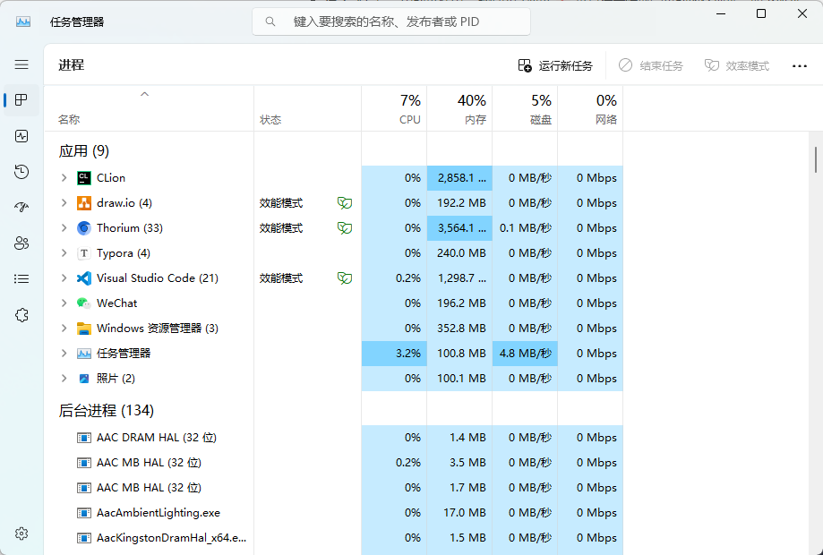
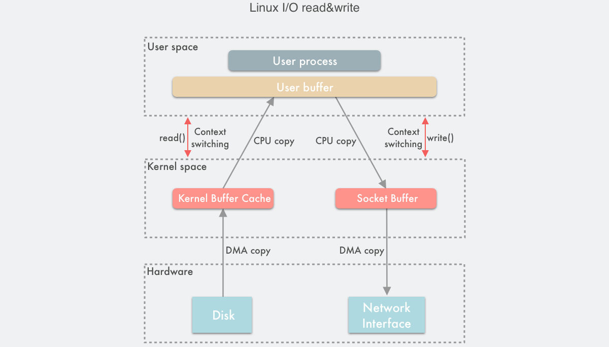
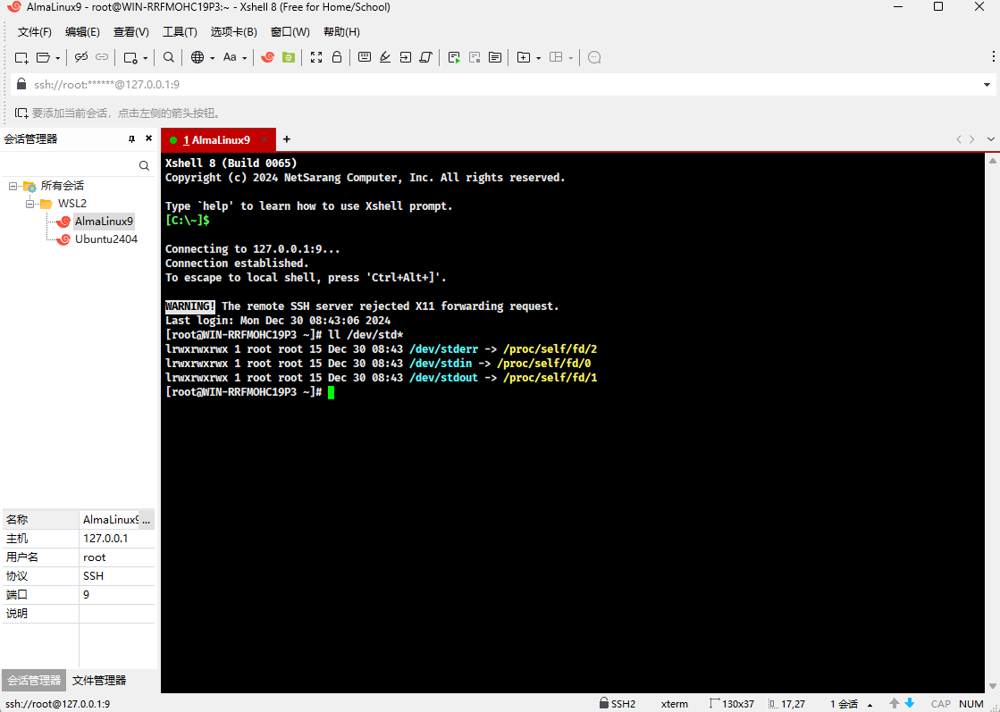

# 第一章：回顾知识

## 1.1 用户态和内核态

* 在现代操作系统中，`用户态（User Mode）`和`内核态（Kernel Mode）`是两种不同的执行模式，它们对系统资源的访问权限有着本质的区别。这种区分是为了提供一个稳定和安全的运行环境，防止用户程序直接操作硬件设备和关键的系统资源，从而可能引起系统的不稳定或安全问题。

> [!NOTE]
>
> 有的时候，也会将`用户态`称为`用户空间`，而`内核态`称为`内核空间`。


- 内核态（Kernel Mode） VS 用户态（User Mode）：

| 类型   | 内核态（Kernel Mode）                                        | 用户态（User Mode）                                          |
| :----- | :----------------------------------------------------------- | :----------------------------------------------------------- |
| 权限   | 内核态是操作系统代码运行的模式，拥有访问系统全部资源和执行硬件操作的`最高权限`。在这种模式下，操作系统的核心部分可以直接访问内存、硬件设备控制、管理文件系统和网络通信等。 | 用户态是普通应用程序运行的模式，具有`较低`的系统资源访问权限。在用户态，程序不能直接执行硬件操作，必须通过操作系统提供的接口（即系统调用）来请求服务。 |
| 安全性 | 由于内核态具有如此高的权限，因此只有可信的、经过严格审查的操作系统核心组件才被允许在此模式下运行。这样可以保护系统不被恶意软件破坏。 | 用户态为系统提供了一层保护，确保用户程序不能直接访问关键的系统资源，防止系统崩溃和数据泄露。 |
| 功能   | 内核态提供了`系统调用`的接口，允许用户态程序安全地请求使用操作系统提供的服务，比如：文件操作、网络通信、内存管理等。 | 用户态保证了操作系统的稳定性和安全性，同时也使得多个程序可以在相互隔离的环境中同时运行，避免相互干扰。 |

> [!NOTE]
>
> - ① 操作系统通过用户态和内核态的分离，实现了对系统资源的保护和控制。
> - ② 当用户程序需要进行文件读写、网络通信或其他需要操作系统介入的操作时，会发生从用户态到内核态的切换。这通过系统调用（System Call）实现，系统调用是用户程序与操作系统内核通信的桥梁。
> - ③ 执行完毕后，系统从内核态返回用户态，继续执行用户程序。
> - ④ 用户态和内核态的这种分离设计是现代操作系统中实现安全、稳定运行的关键机制之一。


* 示例：

```java
import java.io.IOException;
import java.nio.file.Files;
import java.nio.file.Path;
import java.nio.file.Paths;
import java.util.List;

public class Demo {
    public static void writeFile(String filePath, String content) {
        Path path = Paths.get(filePath);
        try {
            Files.write(path, content.getBytes());
        } catch (IOException e) {
            e.printStackTrace();
        }
    }
    public static void main(String[] args){
        // 用户态
        int a = 10;                                 
        int b = 20;                                 
        int c = a + b;                              
        string filePath = "c:/demo.txt";           
        string txt = a + b + c;                    
        
        // 从用户态切换到内核态完成文件写入
        writeFile(filePath, a); // [!code highlight]                   
        
        // 从内核态切换回用户态
        System.out.println(a);                      
        System.out.println(b);                      
        System.out.println(c);                     
    }
}
```

## 1.2 虚拟地址空间

### 1.2.1 概述

* 在学习 C 语言中的过程中，我们可以通过 `&` 运算符来获取变量的内存地址，如下所示：

```c
#include <stdio.h>

// 全局变量
int a = 10;
int b = 20;

int main() {

    // 禁用 stdout 缓冲区
    setbuf(stdout, nullptr);

    printf("a = %p\n", &a); // a = 0x55fda7351010
    printf("b = %p\n", &b); // b = 0x55fda7351014

    return 0;
}
```

* 我们也知道，现代操作系统是`多用户`、`多任务`、`图形化`、`网络化`的操作系统。其中，所谓的`多任务`就是可以支持多个应用程序（进程），如下所示：



> [!NOTE]
>
> - ① 正如上面的程序一样，程序在链接的时候，内存地址就已经确定了，无法改变。
> - ② 如果此时，物理内存中的内存地址已经被该程序占用了，那么其它程序岂不是运行不了？
> - ③ 如果此时，物理内存中的内存地址已经被其它程序占用了，那么该程序岂不是运行不了？

- 其实，这些地址都是假的，并不是真实的物理地址，而是虚拟地址（虚地址）。虚拟地址（虚地址）需要通过 CPU 内部的 MMU（Memory Management Unit，内存管理单元）来将这些虚拟地址（虚地址）转换为物理地址（实地址），如下所示：


### 1.2.2 虚拟地址空间模型

* 为了更好的管理程序，操作系统将虚拟地址空间分为了不同的内存区域，这些内存区域存放的数据、用途、特点等皆有不同，下面是 Linux 下 32 位环境的经典内存模型，如下所示：


* 每个内存区域的特点，如下所示：

| 内存分区                  | 说明                                                         |
| :------------------------ | :----------------------------------------------------------- |
| 程序代码区（code）        | 存储程序的执行代码，通常为只读区，包含程序的指令。 程序启动时，这部分内存被加载到内存中，并不会在程序执行期间改变。 |
| 常量区（constant）        | 存放程序中定义的常量值，通常也是只读的，这些常量在程序运行期间不可修改。 |
| 全局数据区（global data） | 存储程序中定义的全局变量和静态变量。 这些变量在程序的整个生命周期内存在，且可以被修改。 |
| 堆区（heap）              | 用于动态分配内存，例如：通过 `malloc` 或 `new` 分配的内存块。 堆区的内存由程序员手动管理，负责分配和释放。 如果程序员不释放，程序运行结束时由操作系统回收。 |
| 动态链接库                | 动态链接库（如： `.dll` 或 `.so` 文件）被加载到内存中特定的区域，供程序运行时使用。 |
| 栈区（stack）             | 用于存储函数调用的局部变量、函数参数和返回地址。 栈是自动管理的，随着函数的调用和返回，栈上的内存会自动分配和释放。 |

> [!NOTE]
>
> - ① 程序代码区、常量区、全局数据区在程序加载到内存后就分配好了，并且在程序运行期间一直存在，不能销毁也不能增加（大小已被固定），只能等到程序运行结束后由操作系统收回，所以全局变量、字符串常量等在程序的任何地方都能访问，因为它们的内存一直都在。
> - ② 函数被调用时，会将参数、局部变量、返回地址等与函数相关的信息压入栈中，函数执行结束后，这些信息都将被销毁。所以局部变量、参数只在当前函数中有效，不能传递到函数外部，因为它们的内存不在了。
> - ③ 常量区、全局数据区、栈上的内存由系统自动分配和释放，不能由程序员控制。程序员唯一能控制的内存区域就是堆（Heap）：它是一块巨大的内存空间，常常占据整个虚拟空间的绝大部分，在这片空间中，程序可以申请一块内存，并自由地使用（放入任何数据）。堆内存在程序主动释放之前会一直存在，不随函数的结束而失效。在函数内部产生的数据只要放到堆中，就可以在函数外部使用。

* 在 64 位 Linux 环境下，虚拟地址空间大小为 256TB，Linux 将高 128TB 的空间分配给内核使用，而将低 128TB 的空间分配给用户程序使用，如下所示：


> [!NOTE]
>
> - ① `程序代码区`，也可以称为`代码段`；而`全局数据区`和`常量区`，也可以称为`数据段`。
> - ② `全局数据区`分为`初始化数据段`（存储已初始化的全局变量和静态变量）和`未初始化数据段`（存储未初始化的全局变量和静态变量）；`常量区`也称为`只读数据段`，通常是只读的，防止数据被修改。
> - ③ 冯·诺依曼体系结构中的`程序`，也被称为`存储式程序`，需要通过加载器（Loader），将程序从硬盘加载到内存中运行。
> - ④ `存储式程序`中的`程序`分为`指令`和`数据`；其中，`代码段`中保存的是`指令`，`数据段`中保存的是`数据`。

## 1.3 Linux 的标准 IO 缓冲区

* 当我们在 C 程序中调用`标准输入函数`（如：scanf()、gets() ）和`标准输出函数`（如：printf()、puts()等），其实就使用到了`标准输入缓冲区`和`标准输出缓冲区`，如下所示：


## 1.4 Linux 传统的 IO 读写模式

* Linux 中传统的 I/O 读写是通过`read()/write()`系统调用完成的。 `read()`将数据从内存（磁盘、网卡等）读取到用户缓冲区， `write()`将数据从用户缓冲区写入内存，如下所示：


# 第二章：流模型

## 2.1 什么是流模型？

* 在计算机编程过程中，我们经常会遇到以下的需求：
  * `输入`（Input）：到将数据从`外部数据源（`文件、网络、键盘输入等）读取到`程序`中进行处理，这个过程包括：从文件读取文本、接收网络数据以及处理用户输入。
  * `输出`（Output）：将`程序处理后的数据`写回到`外部目的地`（文件、网络、显示器等），这个过程包括：将结果保存到文件中、发送数据到网络以及在屏幕上显示信息。


* 上述的两个场景涵盖了程序（或进程）和外部数据交互的过程，这也是我们熟悉的 IO 操作了。

> [!NOTE]
>
> ::: details 点我查看 `CPU 密集型`和`IO 密集型`
>
> * ① `IO 密集型`：程序主要耗费时间在 I/O 操作上（磁盘读写、网络通信、数据库查询等），而非复杂的计算。
>   * 特点：
>     * CPU 利用率较低，因为任务大部分时间都在等待 I/O 操作完成。
>     * 程序的性能瓶颈通常取决于磁盘、网络或数据库的速度。
>     * 适合用多线程/多进程提升并发度，以更好地利用 I/O 资源。
>   * 应用场景：
>     * 文件操作：读取/写入大文件（文本处理、日志文件操作等）。
>     * 网络通信：HTTP 请求、Web 服务调用、Socket 数据传输等。
>     * 数据库访问：执行 SQL 查询、读取或写入大量数据。
>     * 消息队列：消费或生产消息到 Kafka、RabbitMQ 等消息队列。
>     * 远程调用：RPC 调用、RESTful API 调用等。
> * ② `CPU 密集型`：程序主要耗费时间在 CPU 的计算操作上（数学计算、数据处理、加解密等），而不是等待外部资源。
>   * 特点：
>     * CPU 利用率较高，通常任务对计算性能有很高要求。
>     * 程序的性能瓶颈取决于 CPU 的运算能力。
>     * 使用多线程能提升性能，但线程数过多可能导致上下文切换开销增大，效果反而变差。
>   * 应用场景：
>     * 复杂数学计算：矩阵计算、大数运算等。
>     * 加密解密：MD5、SHA、AES 等加密算法。
>     * 数据压缩/解压：GZIP 压缩。
>     * 机器学习模型计算：深度学习的推理与训练。
>     * 图像/视频处理：图像渲染、视频编码等。
>
> :::

* 从`进程`自身的角度来看，如下所示：
  * `输入`就是将数据从外部环境（文件、网络、键盘等）读入到程序内存中。
  * `输出`就是将数据从程序内存写出到外部环境（文件、网络、显示器等）。

* 其对应的图示，如下所示：


* 这个数据的交换过程非常复杂，如果程序员自己通过编写代码来实现这一过程，不太现实也不太高效。为了简化这一任务，现代操作系统就提供了一种称为`流`（stream）的数据处理模型。

> [!IMPORTANT]
>
> * ① 这种模型抽象简化了 IO 操作，使得程序员可以通过简单、统一的方式来处理各种形式的数据输入和输出。
> * ② 通过这种方式，操作系统帮助程序员减少了直接处理底层 IO 细节的负担，使得程序员可以专注于实现程序的核心逻辑。

* 我们可以将`流`想象成是一条自动运行的流水线，如下所示：


* 在`流`中的数据是自动流动的，作为程序员我们不需要考虑数据是如何流动的，只需要通过一些简单固定的 API 就可以实现数据的处理，即：面向接口编程。


* 我们也可以将`流`进一步`分类`，如下所示：
  * `输入流`：用于从数据源（键盘、文件、网络等）读取数据，这就是程序员通常所说的`读数据流`。
  * `输出流`：用于向目的地（显示器、文件、网络等）写入数据，这就是程序员通常所说的`写输出流`。

> [!CAUTION]
>
> * ① 在 C 语言中，`流`是没有严格区分`输入流`和`输出流`，即：同一个`流`既可以是`输入流`也可以是`输出流`。
> * ② 在 C 之后的语言，如：Java 等，都将`流`严格分为了`输入流`和`输出流`，即：`流`只能是`输入流`或`输出流`。

## 2.2 流模型的优缺点

* 流模型的优点：
  * ① `抽象和简化`：流模型抽象化了输入/输出操作，使得程序员无需关心数据来源或去向的具体细节，从而简化了编程工作。
  * ② `统一性`：任何数据源或目的地，操作的 API 都是一样的。
  * ③ `顺序访问`：可以实现将文件从头到尾读取，方便了程序员编程实现功能。

* 流模型的缺点：
  * ① `额外的性能开销`。
  * ② `资源管理：流也是一种资源，打开就意味着要关闭`。

## 2.3 流模型和缓冲区的关系

* Linux 中传统的 I/O 读写是通过`read()/write()`系统调用完成的。 `read()`将数据从内存（磁盘、网卡等）读取到用户缓冲区， `write()`将数据从用户缓冲区写入内存，如下所示：



* 在 Linux 中，流模型是对 `read()/write()` 的进一步抽象，当然具有缓冲区，有如下的好处：
  * ① 减少底层系统的访问次数，从而提升性能。
  * ② 整合数据。比如输入缓冲区可以将数据源的输入整合，从而允许程序员一次读一大块数据。
  * ③ 阻塞作用。缓冲区往往具有刷新机制，比如输出缓冲区中的数据一般都需要刷新才能输出到目的地。

## 2.4 缓冲区的分类

* 缓冲区有一个显著的特点：`当满足某个触发条件后，程序会开始对缓冲区的数据执行输入或输出操作`。而这种`满足某个条件，就触发数据传输`的行为，就称为`缓冲区的自动刷新`机制。


* 基于这种自动刷新的触发条件的不同，我们可以将缓冲区划分为以下三种类型：
  - ① `全缓冲（满缓冲）`：仅当缓冲区达到容量上限时，缓冲区才会自动刷新，并开始处理数据。否则，数据会持续积累在缓冲区中直到缓冲区满触发自动刷新。`文件操作`的输出缓冲区便是这种类型的经典例子。
  - ② `行缓冲`：缓冲区一旦遇到换行符，缓冲区就会自动刷新，所有数据都会被传输。`stdout` 缓冲区就是典型的行缓冲区。
  - ③ `无缓冲（不缓冲）`：在此模式下，数据不经过中间的缓冲步骤，每次的输入或输出操作都会直接执行。这种方法适用于需要快速、实时响应的场合。`stderr`（标准错误输出）就是这种方式，它经常被用来即时上报错误信息。

> [!CAUTION]
>
> - ① 无论是哪种类型的缓冲区，当缓冲区满了时，都会触发自动刷新。
>   - 全缓冲区：唯一的自动刷新条件是缓冲区满。
>   - 行缓冲区：除了缓冲区满导致的自动刷新，还有遇到换行符的自动刷新机制。
> - ② 手动刷新：大多数缓冲区提供了手动刷新的机制，如：使用 `fflush` 函数来刷新 stdout 缓冲区，也可以使用 `setbuf` 函数来禁用缓冲区。
> - ③ `输出缓冲区中的数据需要刷新才能输出到目的地，但输入缓冲区通常不需要刷新，强制刷新输入缓冲区往往会引发未定义行为。`
> - ④ 当程序执行完毕（如：main 函数返回）时，缓冲区通常会自动刷新，除此之外，还有一些独特的机制也可以刷新缓冲区。但这些机制可能因不同的编译器或平台而异，不能作为常规手段。`强烈建议依赖手动或者常规自动刷新的机制来完成缓冲区的刷新。`
> - ⑤ 缓冲区还具有队列一样的先进先出特点，保证了文件读写的顺序进行。


# 第三章：文件流

## 3.1 概述

* 文件流是流的一种特殊的类型，专门用于文件的读写。在 C 语言中，文件流是与文件相关联的输入/输出流，它使得程序可以从文件当中读取数据，或向文件当中写入数据。

## 3.2 标准流

### 3.2.1 概述

* C 语言对流的访问是通过文件指针实现的，它的类型是 `FILE*`，并且在 `<stdio.h>`头文件中提供了 3 个`标准流`，如下所示：

| 文件指针 | 流       | 默认含义     |
| -------- | -------- | ------------ |
| stdin    | 标准输入 | 键盘         |
| stdout   | 标准输出 | 屏幕或显示器 |
| stderr   | 标准错误 | 屏幕或显示器 |

> [!CAUTION]
>
> 这 3 个标准流我们既不需要手动创建它们，也不需要手动关闭它们，因为它们是操作系统帮助我们管理的。

* 其实，在操作系统启动的时候，就会为我们创建这 3 个标准的流，如下所示：



* 既然文件流有缓冲区，标准流当然也不例外，如下所示：


* 当然，我们也可以这么画，如下所示：


###   3.2.2 putchar() 函数和 getchar()  函数

* putchar() 函数的声明：

```c
int putchar (int c);
```

* getchar() 函数的声明：

```c
int getchar (void);
```

> [!NOTE]
>
> * ① `getchar` 函数从屏幕读取下一个可用的字符，并把它返回为一个整数。这个函数在同一个时间内只会读取一个单一的字符。
> * ② `putchar` 函数把字符输出到屏幕上，并返回相同的字符。这个函数在同一个时间内只会输出一个单一的字符。


* 示例：

```c
#include <stdio.h>

int main() {

    // 禁用 stdout 缓冲区
    setbuf(stdout, nullptr);

    int c;
    printf("请输入一个字符：");
    c = getchar(); // [!code highlight]

    putchar(c); // [!code highlight]
    printf("c = %c\n", c);

    return 0;
}
```

### 3.2.3 scanf() 函数和 printf() 函数


### 3.2.4 gets() 函数和 puts() 函数


## 3.3 文件流的分类


  

  
