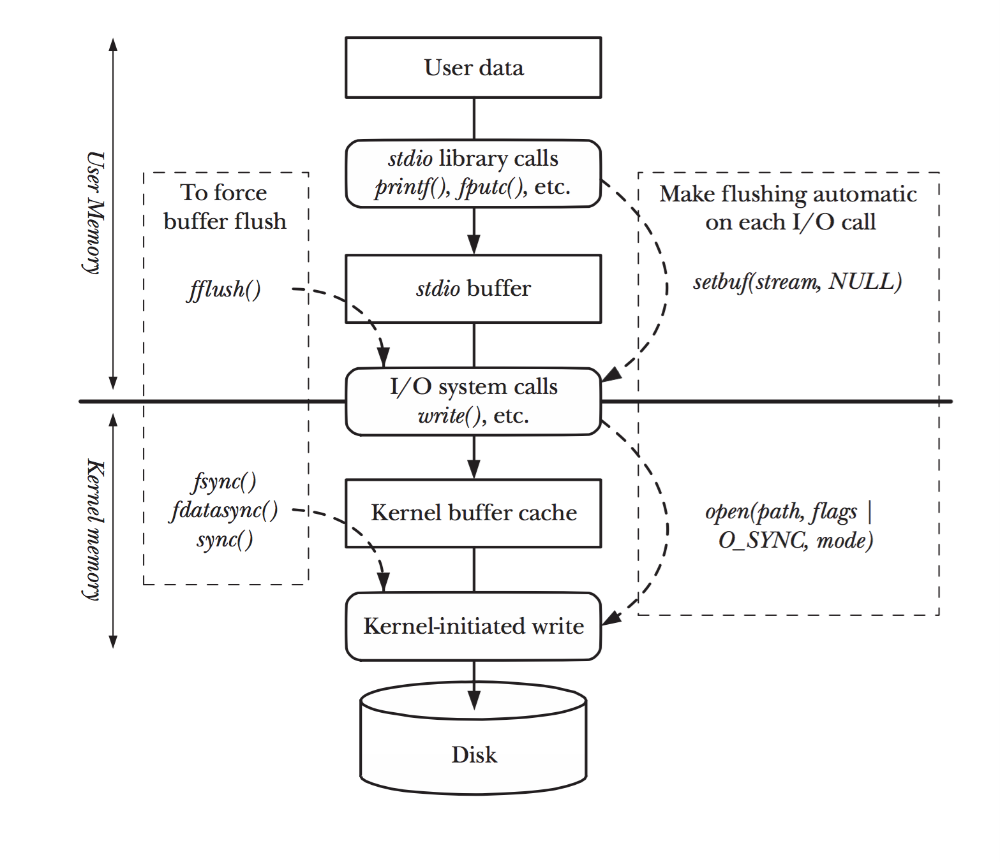

# 第一章：回顾知识

## 1.1 用户态和内核态

* 在现代操作系统中，`用户态（User Mode）`和`内核态（Kernel Mode）`是两种不同的执行模式，它们对系统资源的访问权限有着本质的区别。这种区分是为了提供一个稳定和安全的运行环境，防止用户程序直接操作硬件设备和关键的系统资源，从而可能引起系统的不稳定或安全问题。

> [!NOTE]
>
> 有的时候，也会将`用户态`称为`用户空间`，而`内核态`称为`内核空间`。


- 内核态（Kernel Mode） VS 用户态（User Mode）：

| 类型   | 内核态（Kernel Mode）                                        | 用户态（User Mode）                                          |
| :----- | :----------------------------------------------------------- | :----------------------------------------------------------- |
| 权限   | 内核态是操作系统代码运行的模式，拥有访问系统全部资源和执行硬件操作的`最高权限`。在这种模式下，操作系统的核心部分可以直接访问内存、硬件设备控制、管理文件系统和网络通信等。 | 用户态是普通应用程序运行的模式，具有`较低`的系统资源访问权限。在用户态，程序不能直接执行硬件操作，必须通过操作系统提供的接口（即系统调用）来请求服务。 |
| 安全性 | 由于内核态具有如此高的权限，因此只有可信的、经过严格审查的操作系统核心组件才被允许在此模式下运行。这样可以保护系统不被恶意软件破坏。 | 用户态为系统提供了一层保护，确保用户程序不能直接访问关键的系统资源，防止系统崩溃和数据泄露。 |
| 功能   | 内核态提供了`系统调用`的接口，允许用户态程序安全地请求使用操作系统提供的服务，比如：文件操作、网络通信、内存管理等。 | 用户态保证了操作系统的稳定性和安全性，同时也使得多个程序可以在相互隔离的环境中同时运行，避免相互干扰。 |

> [!NOTE]
>
> - ① 操作系统通过用户态和内核态的分离，实现了对系统资源的保护和控制。
> - ② 当用户程序需要进行文件读写、网络通信或其他需要操作系统介入的操作时，会发生从用户态到内核态的切换。这通过系统调用（System Call）实现，系统调用是用户程序与操作系统内核通信的桥梁。
> - ③ 执行完毕后，系统从内核态返回用户态，继续执行用户程序。
> - ④ 用户态和内核态的这种分离设计是现代操作系统中实现安全、稳定运行的关键机制之一。


* 示例：

```java
import java.io.IOException;
import java.nio.file.Files;
import java.nio.file.Path;
import java.nio.file.Paths;
import java.util.List;

public class Demo {
    public static void writeFile(String filePath, String content) {
        Path path = Paths.get(filePath);
        try {
            Files.write(path, content.getBytes());
        } catch (IOException e) {
            e.printStackTrace();
        }
    }
    public static void main(String[] args){
        // 用户态
        int a = 10;                                 
        int b = 20;                                 
        int c = a + b;                              
        string filePath = "c:/demo.txt";           
        string txt = a + b + c;                    
        
        // 从用户态切换到内核态完成文件写入
        writeFile(filePath, a); // [!code highlight]                   
        
        // 从内核态切换回用户态
        System.out.println(a);                      
        System.out.println(b);                      
        System.out.println(c);                     
    }
}
```

## 1.2 虚拟地址空间

### 1.2.1 概述

* 在学习 C 语言中的过程中，我们可以通过 `&` 运算符来获取变量的内存地址，如下所示：

```c
#include <stdio.h>

// 全局变量
int a = 10;
int b = 20;

int main() {

    // 禁用 stdout 缓冲区
    setbuf(stdout, nullptr);

    printf("a = %p\n", &a); // a = 0x55fda7351010
    printf("b = %p\n", &b); // b = 0x55fda7351014

    return 0;
}
```

* 我们也知道，现代操作系统是`多用户`、`多任务`、`图形化`、`网络化`的操作系统。其中，所谓的`多任务`就是可以支持多个应用程序（进程），如下所示：


> [!NOTE]
>
> - ① 正如上面的程序一样，程序在链接的时候，内存地址就已经确定了，无法改变。
> - ② 如果此时，物理内存中的内存地址已经被该程序占用了，那么其它程序岂不是运行不了？
> - ③ 如果此时，物理内存中的内存地址已经被其它程序占用了，那么该程序岂不是运行不了？

- 其实，这些地址都是假的，并不是真实的物理地址，而是虚拟地址（虚地址）。虚拟地址（虚地址）需要通过 CPU 内部的 MMU（Memory Management Unit，内存管理单元）来将这些虚拟地址（虚地址）转换为物理地址（实地址），如下所示：


### 1.2.2 虚拟地址空间模型

* 为了更好的管理程序，操作系统将虚拟地址空间分为了不同的内存区域，这些内存区域存放的数据、用途、特点等皆有不同，下面是 Linux 下 32 位环境的经典内存模型，如下所示：


* 每个内存区域的特点，如下所示：

| 内存分区                  | 说明                                                         |
| :------------------------ | :----------------------------------------------------------- |
| 程序代码区（code）        | 存储程序的执行代码，通常为只读区，包含程序的指令。 程序启动时，这部分内存被加载到内存中，并不会在程序执行期间改变。 |
| 常量区（constant）        | 存放程序中定义的常量值，通常也是只读的，这些常量在程序运行期间不可修改。 |
| 全局数据区（global data） | 存储程序中定义的全局变量和静态变量。 这些变量在程序的整个生命周期内存在，且可以被修改。 |
| 堆区（heap）              | 用于动态分配内存，例如：通过 `malloc` 或 `new` 分配的内存块。 堆区的内存由程序员手动管理，负责分配和释放。 如果程序员不释放，程序运行结束时由操作系统回收。 |
| 动态链接库                | 动态链接库（如： `.dll` 或 `.so` 文件）被加载到内存中特定的区域，供程序运行时使用。 |
| 栈区（stack）             | 用于存储函数调用的局部变量、函数参数和返回地址。 栈是自动管理的，随着函数的调用和返回，栈上的内存会自动分配和释放。 |

> [!NOTE]
>
> - ① 程序代码区、常量区、全局数据区在程序加载到内存后就分配好了，并且在程序运行期间一直存在，不能销毁也不能增加（大小已被固定），只能等到程序运行结束后由操作系统收回，所以全局变量、字符串常量等在程序的任何地方都能访问，因为它们的内存一直都在。
> - ② 函数被调用时，会将参数、局部变量、返回地址等与函数相关的信息压入栈中，函数执行结束后，这些信息都将被销毁。所以局部变量、参数只在当前函数中有效，不能传递到函数外部，因为它们的内存不在了。
> - ③ 常量区、全局数据区、栈上的内存由系统自动分配和释放，不能由程序员控制。程序员唯一能控制的内存区域就是堆（Heap）：它是一块巨大的内存空间，常常占据整个虚拟空间的绝大部分，在这片空间中，程序可以申请一块内存，并自由地使用（放入任何数据）。堆内存在程序主动释放之前会一直存在，不随函数的结束而失效。在函数内部产生的数据只要放到堆中，就可以在函数外部使用。

* 在 64 位 Linux 环境下，虚拟地址空间大小为 256TB，Linux 将高 128TB 的空间分配给内核使用，而将低 128TB 的空间分配给用户程序使用，如下所示：


> [!NOTE]
>
> - ① `程序代码区`，也可以称为`代码段`；而`全局数据区`和`常量区`，也可以称为`数据段`。
> - ② `全局数据区`分为`初始化数据段`（存储已初始化的全局变量和静态变量）和`未初始化数据段`（存储未初始化的全局变量和静态变量）；`常量区`也称为`只读数据段`，通常是只读的，防止数据被修改。
> - ③ 冯·诺依曼体系结构中的`程序`，也被称为`存储式程序`，需要通过加载器（Loader），将程序从硬盘加载到内存中运行。
> - ④ `存储式程序`中的`程序`分为`指令`和`数据`；其中，`代码段`中保存的是`指令`，`数据段`中保存的是`数据`。

### 1.2.3 虚拟地址空间和用户态以及内核态

* 既然我们已经了解了`虚拟地址空间`、`用户态`以及`内核态`，那么我们就可以知道：哪些虚拟地址空间是用户态，哪些虚拟地址空间是内核态，如下所示：


## 1.3 Linux 的标准 IO 缓冲区

* 当我们在 C 程序中调用`标准输入函数`（如：scanf()、gets() ）和`标准输出函数`（如：printf()、puts()等），其实就使用到了`标准输入缓冲区`和`标准输出缓冲区`，如下所示：



## 1.4 Linux 传统的 IO 读写模式

* Linux 中传统的 I/O 读写是通过`read()/write()`系统调用完成的。 `read()`将数据从内存（磁盘、网卡等）读取到用户缓冲区， `write()`将数据从用户缓冲区写入内存，如下所示：


